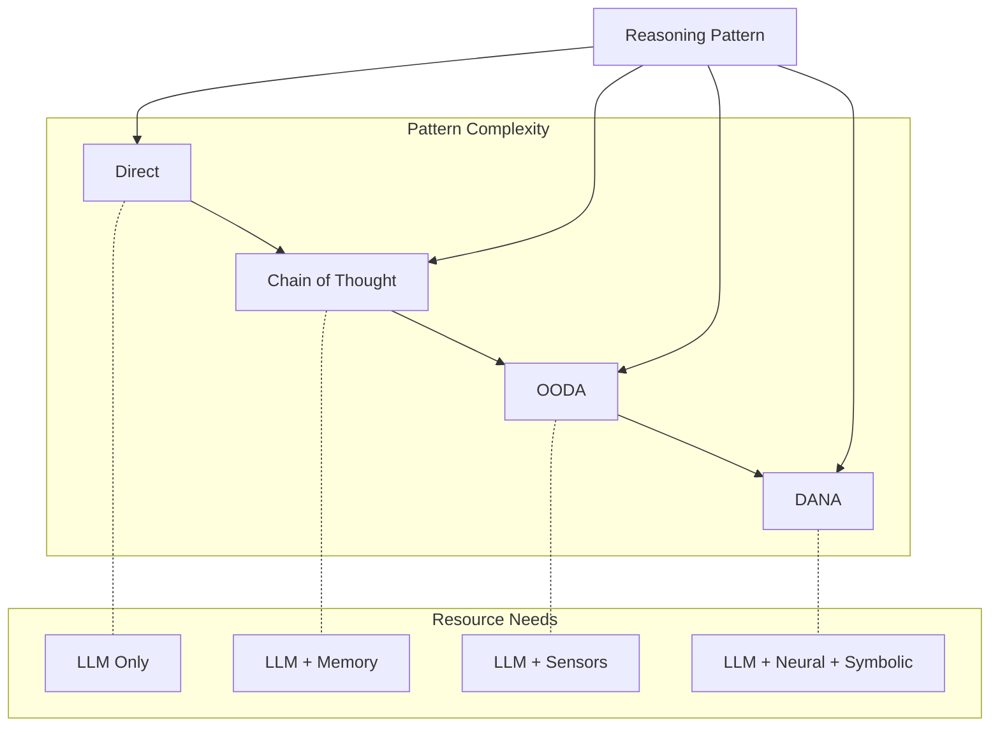

<!-- markdownlint-disable MD041 -->
<!-- markdownlint-disable MD033 -->
<p align="center">
  
</p>

[Project Overview](../../../README.md) | [Main Documentation](../../../docs/README.md)

# Reasoning System

## dxa.core.reasoning Module

The reasoning layer is the tactical brain of the DXA agent system, responsible for executing plans and making step-by-step decisions. While the planning layer decides what to do, ReasoningPatterns determine how to think about each step. It implements various patterns - from simple direct queries to sophisticated neural-symbolic reasoning - each optimized for different types of tasks. The reasoning layer maintains continuous communication with planning through signals, allowing for dynamic adaptation as new information is discovered or circumstances change. This separation of strategic and tactical thinking enables both simple, one-shot tasks and complex, evolving objectives to be handled effectively.

## Design Philosophy

> Simple things should be easy, complex things should be possible.

This principle guides our ReasoningPattern design:

- Direct ReasoningPattern for simple queries (one line of code)
- Chain of Thought ReasoningPattern for clearer thinking (when needed)
- OODA ReasoningPattern for continuous adaptation (when appropriate)
- DANA ReasoningPattern for sophisticated neural-symbolic integration (when beneficial)

Each pattern builds on the same foundation but adds power and flexibility where needed.

See also:

- [DXA Home](../../../README.md) - Overview of the entire system
- [Agent Documentation](../../agent/README.md) - Agent implementation and usage
- [Planning System](../planning/README.md) - Strategic planning layer
- [Resource Management](../resource/README.md) - Tool and capability integration
- [IO System](../io/README.md) - Interaction handling

## Architecture



## Usage Guide

### Simple Query

```python
# Direct reasoning for simple tasks
agent = Agent("assistant")\
    .with_reasoning("direct")
result = await agent.run("What is quantum computing?")
```

### Complex Analysis

```python
# Chain of thought for step-by-step analysis
agent = Agent("analyst")\
    .with_reasoning("cot")\
    .with_resources({
        "memory": MemoryResource(),  # Track reasoning steps
        "search": SearchResource()    # Look up information
    })

result = await agent.run({
    "task": "analyze",
    "topic": "Impact of quantum computing on cryptography",
    "depth": "technical"
})
```

### Continuous Monitoring

```python
# OODA for adaptive monitoring
agent = Agent("monitor")\
    .with_reasoning("ooda")\
    .with_resources({
        "sensors": SystemSensors(),
        "alerts": AlertSystem()
    })

async with agent:
    await agent.run({
        "task": "monitor_system",
        "metrics": ["cpu", "memory"],
        "thresholds": {"cpu_high": 80}
    })
```

### Domain-Specific Tasks

```python
# DANA for specialized tasks
agent = Agent("optimizer")\
    .with_reasoning("dana")\
    .with_resources({
        "vector_db": VectorDB(),     # Pattern matching
        "runtime": CodeExecutor()     # Run generated code
    })

result = await agent.run({
    "task": "optimize",
    "target": my_function,
    "constraints": {
        "max_time": "100ms",
        "memory_limit": "10mb"
    }
})
```

### Pattern Selection Guide

Choose your reasoning pattern based on:

1. Task Complexity
   - Simple Q&A → Direct
   - Multi-step analysis → Chain of Thought
   - Real-time adaptation → OODA
   - Domain expertise → DANA

2. Resource Availability
   - Minimal resources → Direct
   - Memory needs → Chain of Thought
   - Sensor access → OODA
   - Full toolkit → DANA

3. Performance Requirements
   - Quick response → Direct
   - Verifiable logic → Chain of Thought
   - Continuous operation → OODA
   - Optimal solutions → DANA

## Reasoning Patterns

1. Direct Reasoning
   - Simple LLM queries
   - Quick responses
   - Minimal processing

2. Chain of Thought
   - Step-by-step thinking
   - Explicit reasoning
   - Verifiable logic

3. OODA Loop
   - Observe-Orient-Decide-Act
   - Continuous monitoring
   - Adaptive response

4. DANA
   - Neural search
   - Symbolic execution
   - Domain adaptation

## Implementation Details

Reasoning patterns leverage the agent's LLM for cognitive operations.

### Pattern Structure

```python
class ReasoningPattern:
    """Base class for all reasoning patterns."""
    
    async def reason_about_step(self, step: Dict, context: Context) -> Result:
        """Apply reasoning to a single step."""
        raise NotImplementedError
```

### State Management

Each reasoning pattern maintains:

- Current step state
- Intermediate results
- Confidence metrics
- Resource usage

### Signal Generation

Patterns can signal:

- Need for plan updates
- Resource issues
- Discovery of new information
- Completion status

## Pattern Details

### Direct Reasoning

Best for: Simple, single-step tasks

```python
class DirectReasoning(ReasoningPattern):
    async def reason_about_step(self, step, context):
        prompt = self._create_prompt(step)
        response = await context.llm.query(prompt)
        return self._process_response(response)
```

### Chain of Thought

Best for: Complex problem solving

Steps:

1. Break down problem
2. Consider each part
3. Show reasoning steps
4. Synthesize conclusion

```python
class ChainOfThoughtReasoning(ReasoningPattern):
    async def reason_about_step(self, step, context):
        thoughts = await self._generate_thoughts(step)
        conclusion = await self._synthesize(thoughts)
        return self._create_result(thoughts, conclusion)
```

### OODA Loop

Best for: Continuous monitoring and response

Cycle:

1. **Observe**: Gather data
2. **Orient**: Analyze situation
3. **Decide**: Choose action
4. **Act**: Execute decision

```python
class OODAReasoning(ReasoningPattern):
    async def reason_about_step(self, step, context):
        observation = await self._observe(step.targets)
        orientation = await self._orient(observation)
        decision = await self._decide(orientation)
        action = await self._act(decision)
        return self._create_result(action)
```

### DANA (Domain-Aware Neural-Symbolic)

Best for: Specialized domain tasks

Process:

1. Neural search for similar patterns
2. Program synthesis/selection
3. Symbolic execution
4. Result validation

```python
class DANAReasoning(ReasoningPattern):
    async def reason_about_step(self, step, context):
        patterns = await self._neural_search(step)
        program = await self._synthesize_program(patterns)
        result = await self._execute_symbolically(program)
        return self._validate_result(result)
```

## Integration with Planning

Reasoning patterns interact with planning through:

1. Step execution results
2. Progress signals
3. Resource updates
4. Discovery notifications

Example:

```python
async def _execute_with_signals(self, step, context):
    # Execute reasoning
    result = await self.reason_about_step(step, context)
    
    # Generate signals
    if self._is_significant(result):
        await self._signal_discovery(result)
    
    # Update progress
    await self._update_metrics(result)
    
    return result
```

## Resource Usage

Each pattern has different resource needs:

- Direct: Minimal (just LLM)
- CoT: Moderate (LLM + memory)
- OODA: Heavy (LLM + sensors + memory)
- DANA: Intensive (LLM + vector DB + runtime)

## Testing and Validation

Patterns should implement:

1. Confidence scoring
2. Result validation
3. Error detection
4. Performance metrics

## Best Practices

1. Pattern Selection
   - Use simplest pattern that works
   - Match pattern to task complexity
   - Consider resource constraints

2. Implementation
   - Clear step definitions
   - Robust error handling
   - Proper resource cleanup
   - Meaningful signals

3. Monitoring
   - Track confidence scores
   - Monitor resource usage
   - Log reasoning steps
   - Measure performance

---

See [Agent Documentation](../../agent/README.md) for integration details.

---

<p align="center">
Copyright © 2024 Aitomatic, Inc. Licensed under the [MIT License](../../../LICENSE.md).
<br/>
<a href="https://aitomatic.com">https://aitomatic.com</a>
</p>
