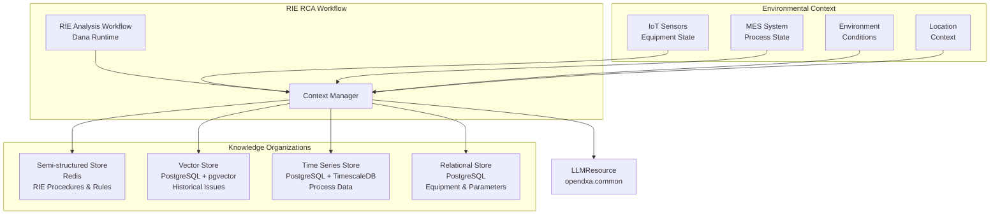
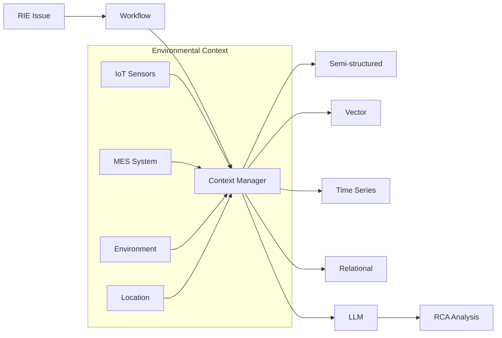

# Design Document: RIE Root Cause Analysis Workflow

<!-- text markdown -->
Author: Aitomatic Engineering
Version: 0.1
Date: 2024-03-19
Status: Design Phase
<!-- end text markdown -->

## Problem Statement
**Brief Description**: Semiconductor manufacturers need an automated, knowledge-driven approach to analyze and resolve RIE process issues, leveraging historical data, process knowledge, and real-time monitoring.

- Current situation: RIE process issues are analyzed manually, relying heavily on expert knowledge and scattered documentation
- Impact: Long resolution times, inconsistent analysis, knowledge loss when experts leave, and missed patterns across similar issues
- Context: RIE is a critical semiconductor manufacturing process where defects can significantly impact yield and quality
- Critical Need: Automated, systematic approach to RIE issue analysis that combines process knowledge, historical data, and real-time monitoring
- Core Constraint: Workflow must be encoded in Dana language for integration with DXA framework

## Goals
**Brief Description**: Create an automated RIE RCA workflow that systematically analyzes process issues using multiple knowledge sources.

- Automate the collection and analysis of RIE process data
- Identify patterns in historical RIE issues
- Provide systematic analysis of potential root causes
- Generate actionable recommendations
- Maintain and update RIE process knowledge
- Enable continuous learning from resolved issues

## Non-Goals
**Brief Description**: Not creating a general-purpose RCA system or replacing human experts.

- Not replacing human expertise in RIE process
- Not automating all aspects of RIE process control
- Not handling non-RIE semiconductor processes
- Not providing real-time process control
- Not managing RIE equipment maintenance

## Proposed Solution
**Brief Description**: A knowledge-driven RIE RCA workflow that combines process knowledge, historical data, and real-time monitoring to systematically analyze and resolve issues.

- Structured RIE process knowledge organization
- Historical issue pattern matching
- Real-time process data analysis
- Systematic root cause analysis
- Actionable recommendation generation

## Proposed Design

### System Architecture Diagram


### Knowledge Organization

#### 1. Semi-structured Store (Redis)
- RIE process procedures
- Equipment specifications
- Material properties
- Safety guidelines
- Troubleshooting rules

#### 2. Vector Store (PostgreSQL + pgvector)
- Historical RIE issues
- Resolution patterns
- Similar case embeddings
- Process parameter correlations
- Equipment failure patterns

#### 3. Time Series Store (PostgreSQL + TimescaleDB)
- Real-time process data
- Historical process trends
- Equipment performance metrics
- Environmental conditions
- Process control parameters

#### 4. Relational Store (PostgreSQL)
- Equipment configurations
- Material specifications
- Process parameters
- Quality metrics
- Maintenance records

### Environmental Context Integration

The workflow integrates multiple sources of environmental context to provide comprehensive analysis:

#### 1. IoT Sensor Data
- Equipment state sensors
- Process parameter measurements
- Environmental conditions
- Real-time monitoring data
- Equipment health metrics

#### 2. MES (Manufacturing Execution System) Data
- Process state information
- Work order details
- Material tracking
- Quality control data
- Production schedules

#### 3. Environmental Conditions
- Temperature
- Humidity
- Air quality
- Vibration
- Power quality

#### 4. Location Context
- Equipment location
- Process area
- Facility conditions
- Zone-specific parameters
- Safety requirements

### Workflow Implementation

#### 1. Issue Detection and Initial Analysis
```dana
def analyze_rie_issue(issue_data: dict) -> dict:
    with ContextManager() as ctx:
        # Add current issue context
        ctx.add_problem(issue_data)
        
        # Query similar historical issues
        similar_cases = query_vector_store(
            embedding=issue_data["symptoms"],
            filters={"process": "RIE"},
            limit=5
        )
        
        # Get real-time process data
        process_data = query_time_series(
            metrics=["pressure", "temperature", "gas_flow"],
            time_range="last_24_hours"
        )
        
        # Get relevant procedures
        procedures = query_semi_structured(
            filters={
                "category": "RIE",
                "type": "troubleshooting",
                "equipment": issue_data["equipment"]
            }
        )
        
        # Initial analysis
        analysis = reason(
            "Analyze RIE issue",
            {
                "current_issue": issue_data,
                "similar_cases": similar_cases,
                "process_data": process_data,
                "procedures": procedures
            }
        )
        
        return analysis
```

#### 2. Root Cause Analysis Pipeline
```dana
# Define analysis steps
def check_equipment_state(data: dict) -> dict:
    return query_relational(
        table="equipment_state",
        filters={"equipment_id": data["equipment_id"]}
    )

def analyze_process_trends(data: dict) -> dict:
    return query_time_series(
        metrics=data["metrics"],
        time_range=data["time_range"]
    )

def find_similar_issues(data: dict) -> list:
    return query_vector_store(
        embedding=data["symptoms"],
        filters={"process": "RIE"}
    )

# Compose RCA pipeline
rie_rca_pipeline = (
    check_equipment_state |
    analyze_process_trends |
    find_similar_issues |
    generate_recommendations
)
```

#### 3. Context-Aware Analysis with Environmental Data
```dana
def perform_rca(issue: dict, context: dict) -> dict:
    with ContextManager() as ctx:
        # Add issue context
        ctx.add_problem(issue)
        
        # Add equipment context
        equipment_data = query_relational(
            table="equipment",
            filters={"id": issue["equipment_id"]}
        )
        ctx.add_equipment(equipment_data)
        
        # Add process context
        process_data = query_time_series(
            metrics=issue["metrics"],
            time_range=issue["time_range"]
        )
        ctx.add_process(process_data)
        
        # Add environmental context
        iot_data = get_iot_data(
            equipment_id=issue["equipment_id"],
            time_range=issue["time_range"]
        )
        ctx.add_environmental(iot_data)
        
        # Add MES context
        mes_data = get_mes_data(
            work_order=issue["work_order"],
            process_id=issue["process_id"]
        )
        ctx.add_mes(mes_data)
        
        # Add location context
        location_data = get_location_context(
            equipment_id=issue["equipment_id"],
            zone=issue["zone"]
        )
        ctx.add_location(location_data)
        
        # Perform analysis with full context
        analysis = reason(
            "Perform RIE RCA",
            {
                "issue": issue,
                "context": ctx.get_context()
            }
        )
        
        return analysis
```

### Data Flow Diagram


## Design Review Checklist
**Status**: [ ] Not Started | [x] In Progress | [ ] Complete

- [ ] Problem Alignment
- [ ] Goal Achievement
- [ ] Non-Goal Compliance
- [ ] KISS/YAGNI Compliance
- [ ] Security review
- [ ] Performance impact
- [ ] Error handling
- [ ] Testing strategy
- [ ] Documentation
- [ ] Backwards compatibility

## Implementation Phases

### Phase 1: Foundation & Architecture (16.7%)
- [ ] Define RIE knowledge structures
- [ ] Create basic workflow infrastructure
- [ ] Establish analysis patterns
- [ ] **Phase Gate**: Tests pass

### Phase 2: Core Functionality (16.7%)
- [ ] Implement issue detection
- [ ] Create RCA pipeline
- [ ] Build knowledge integration
- [ ] **Phase Gate**: Tests pass

### Phase 3: Error Handling (16.7%)
- [ ] Add data validation
- [ ] Implement error handling
- [ ] Add recovery mechanisms
- [ ] **Phase Gate**: Tests pass

### Phase 4: Integration (16.7%)
- [ ] LLM integration
- [ ] Equipment integration
- [ ] Process monitoring
- [ ] **Phase Gate**: Tests pass

### Phase 5: Testing (16.7%)
- [ ] Unit tests
- [ ] Integration tests
- [ ] Performance tests
- [ ] **Phase Gate**: Tests pass

### Phase 6: Documentation (16.7%)
- [ ] API documentation
- [ ] Usage guides
- [ ] Examples
- [ ] **Phase Gate**: Tests pass 