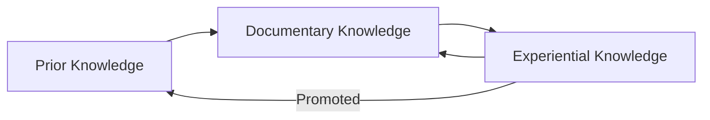

# Dana KNOWS: Structuring Agent Intelligence for the Real World

The core challenge in using LLMs effectively isn't just generating good outputs—it's **getting the right knowledge into the context window at the right time**. Since LLMs operate on a sliding window of tokens, what the model 'knows' is entirely dependent on what you feed it at inference time—and how well that evolves with each reasoning step.

In this view, 'knowledge' becomes a matter of **optimizing the selection, structure, and evolution of what enters the context window**, step by step. That's the fundamental insight that drives Dana and KNOWS.

*By [Your Name], [Your Title or Role]*

When people say "AI agents are the future," they usually mean agents that don't just generate outputs—they **reason, act, and learn**.

But most agent architectures today treat knowledge like a flat list of text chunks. They forget, hallucinate, repeat mistakes, and can't explain themselves. It's all surface, no memory.

That's why we built **Dana**—an agent-native, AI-powered programming language and runtime system designed for building intelligent, learning-capable agents from the ground up. Within Dana, we introduce **KNOWS**: **KNowledge Organization and Workflow Structures**, a lightweight but powerful knowledge-level layer that gives agents structured, contextual, and evolving knowledge.

---

## The KNOWS Framework: A Space-Time View of Knowledge (as a Computational Trade-Off)

At the core of KNOWS is the insight that knowledge management in intelligent agents reflects a **space-time trade-off in computation**:

* **Space** represents the agent's *knowledge-level breadth*—how much and what kind of knowledge it can access or represent at a given moment. This aligns with **Topical knowledge**: definitions, facts, associations, and world models that characterize the agent's operating subspace.—the structure of states, facts, rules, and possibilities. This maps directly to **Topical knowledge**: definitions, properties, correlations, and observations that situate the agent in its domain.
* **Time** captures the agent's *knowledge-level evolution*—how its knowledge state changes through interaction, computation, or feedback. This maps to **Procedural knowledge**: workflows, heuristics, and plans that allow movement across or modification of the knowledge subspace.—the progression of actions, decisions, and feedback that modify what is known. This corresponds to **Procedural knowledge**: how to navigate from one state to another, what to do, and in what sequence.

This duality is also reflected in:

* The transformation of **knowledge phases** (e.g., Prior → Documentary → Experiential → Learned)
* The continual re-shaping of the KB as the agent acts, observes, adapts

---

## Four Orthogonal Knowledge Organizations (KOs)

KNOWS organizes knowledge into four mathematically orthogonal types, each serving a unique, irreplaceable function:

### 1. **Facts & Rules (Relational KB)**
**Purpose**: Store structured facts and enforce business rules
- **Contains**: Equipment specs, compliance requirements, validation rules
- **Retrieval**: Query-based lookup and rule evaluation
- **Example**: "Chamber B2 requires He leak rate < 0.2 for etch processes"

### 2. **Workflows & Procedures (Semi-structured KB)**
**Purpose**: Encode step-by-step processes and decision trees
- **Contains**: SOPs, troubleshooting guides, escalation paths
- **Retrieval**: Context-aware procedure matching
- **Example**: "If etch rate < target → Check gas flow → Adjust pressure → Retest"

### 3. **Similarity Search (Vector-DB KB)**
**Purpose**: Find analogous situations and solutions
- **Contains**: Historical cases, pattern recognition, anomaly detection
- **Retrieval**: Semantic similarity and clustering
- **Example**: Finding similar failure patterns from historical incidents

### 4. **Sequence Store (Time Series DB)**
**Purpose**: Track temporal patterns and trends
- **Contains**: Process history, performance metrics, degradation curves
- **Retrieval**: Time-based analysis and prediction
- **Example**: Equipment performance trending over maintenance cycles

---

## The P-S-T Framework: Knowledge Evolution Through Phases

KNOWS tracks knowledge through three evolutionary phases:

### **Prior Knowledge (P)**
- **Source**: Pre-existing domain expertise, specifications, standards
- **Characteristics**: High confidence, stable, foundational
- **Example**: "Silicon etch rate depends on RF power and pressure"

### **Documentary Knowledge (D)**  
- **Source**: Procedures, manuals, documented best practices
- **Characteristics**: Structured, validated, contextual
- **Example**: "For 200nm etch: Set power to 150W, pressure to 50mTorr"

### **Experiential Knowledge (X)**
- **Source**: Real-time observations, feedback, learned patterns
- **Characteristics**: Dynamic, evolving, situation-specific
- **Example**: "Chamber B2 requires +5W offset due to recent maintenance"

Knowledge flows: **P → D → X**, with experiential insights potentially promoting back to Documentary or even Prior knowledge through validation.

---

## Why KNOWS Beats Traditional RAG

### **Traditional RAG Limitations:**
- **Flat retrieval**: No knowledge hierarchy or relationships
- **No learning**: Static knowledge base doesn't evolve
- **Poor context**: Retrieves chunks without understanding relevance
- **No explainability**: Can't trace knowledge sources or reasoning

### **KNOWS Advantages:**
- **Structured knowledge**: Four orthogonal KOs for different needs
- **Dynamic evolution**: Knowledge improves through P-S-T phases
- **Context-aware retrieval**: Relevance scoring with metadata
- **Full traceability**: Every decision traces to knowledge sources
- **Learning capability**: Experiential knowledge accumulates and promotes

---

## Business Impact: From Reactive to Predictive Operations

### **Manufacturing Example**
**Traditional Approach**: Operators react to alarms using static procedures
- Response time: 15-30 minutes
- Success rate: 70% first-time fix
- Knowledge retention: Individual-dependent

**KNOWS-Enhanced Approach**: Agents proactively identify and resolve issues
- Response time: 2-5 minutes
- Success rate: 90%+ first-time fix  
- Knowledge retention: System-wide learning

### **Financial Services Example**
**Traditional Approach**: Risk assessment using rule-based systems
- Coverage: 60% of scenarios
- Adaptation time: 6-12 months for new regulations
- False positives: 25-30%

**KNOWS-Enhanced Approach**: Adaptive risk intelligence with experiential learning
- Coverage: 85%+ of scenarios
- Adaptation time: Days to weeks
- False positives: <10%

---

## Implementation Strategy: Phased Rollout

### **Phase 1: Foundation (MVP)**
- Implement basic KnowledgeUnit schema with P-S-T metadata
- Build knowledge composer for context optimization
- Create Dana integration for structured knowledge retrieval
- **Timeline**: 1-2 weeks
- **Value**: 20%+ improvement over baseline RAG

### **Phase 2: Learning Loop**
- Add experiential knowledge accumulation
- Implement feedback-driven knowledge promotion
- Build explanation layer for decision traceability
- **Timeline**: 4-6 weeks
- **Value**: Continuous improvement capability

### **Phase 3: Advanced Intelligence**
- Multi-domain knowledge federation
- Predictive knowledge caching
- Cross-agent knowledge sharing
- **Timeline**: 8-12 weeks
- **Value**: Enterprise-scale intelligent operations

---

## Competitive Positioning

### **vs. Traditional RAG (Pinecone, Weaviate)**
- **Knowledge Structure**: Flat chunks → Orthogonal KOs with metadata
- **Learning**: Static → Dynamic evolution through P-S-T phases
- **Context**: Similarity-only → Multi-dimensional relevance scoring
- **Explainability**: None → Full knowledge source traceability

### **vs. Agent Frameworks (LangChain, AutoGPT)**
- **Memory**: Session-based → Persistent, evolving knowledge base
- **Knowledge**: Unstructured → Four orthogonal organizations
- **Learning**: None → Experiential knowledge accumulation
- **Integration**: Tool-calling → Native Dana language support

### **vs. Enterprise AI (IBM Watson, Microsoft Cognitive)**
- **Deployment**: Cloud-dependent → Self-contained Dana runtime
- **Customization**: Limited → Full domain-specific agent programming
- **Knowledge**: Vendor-locked → Open, portable KNOWS framework
- **Evolution**: Manual → Autonomous learning and adaptation

---

## Investment Thesis: The Knowledge Infrastructure Layer

KNOWS represents the **missing infrastructure layer** for intelligent agents:

### **Market Opportunity**
- **TAM**: $150B+ enterprise AI market
- **Growth**: 40%+ annual growth in agent-based automation
- **Pain Point**: Knowledge management is the #1 blocker for AI adoption

### **Technical Moat**
- **Unique Architecture**: Four orthogonal KOs with P-S-T evolution
- **Dana Integration**: Native agent programming language
- **Learning Capability**: Autonomous knowledge improvement
- **Explainability**: Full decision traceability

### **Business Model**
- **Platform**: Dana runtime with KNOWS framework
- **Services**: Knowledge engineering and agent development
- **Marketplace**: Domain-specific knowledge modules
- **Enterprise**: Custom agent development and deployment

---

## Call to Action

The future of AI isn't just about bigger models—it's about **smarter knowledge management**. KNOWS provides the structured, evolving, explainable knowledge layer that transforms reactive systems into intelligent, learning agents.

**For Enterprises**: Start with a single use case to prove 20%+ improvement over existing solutions.

**For Developers**: Build on Dana's agent-native architecture with KNOWS knowledge management.

**For Investors**: Recognize KNOWS as the critical infrastructure layer enabling the next generation of intelligent automation.

The question isn't whether agents will become intelligent—it's whether you'll build with the knowledge architecture that makes intelligence possible.

---

**Ready to structure your agent intelligence? The future is KNOWS.** 