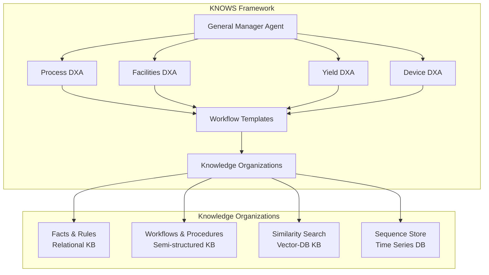
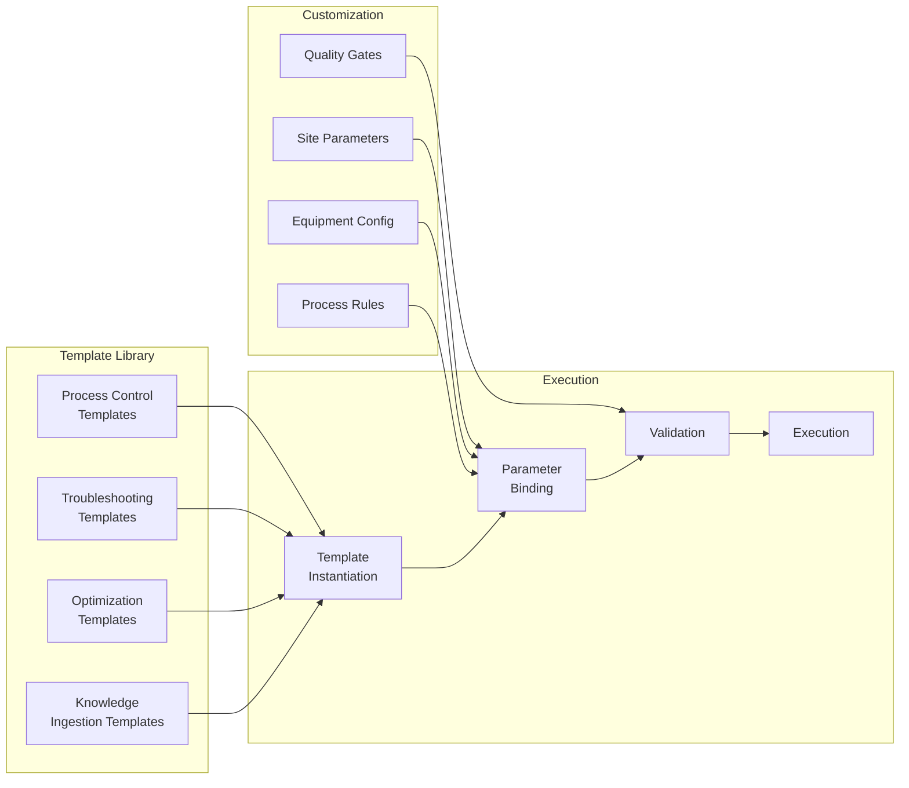
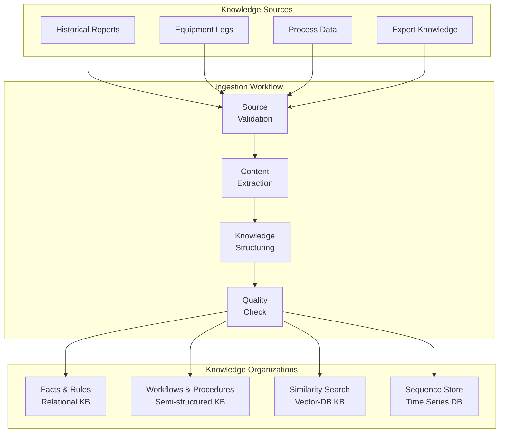
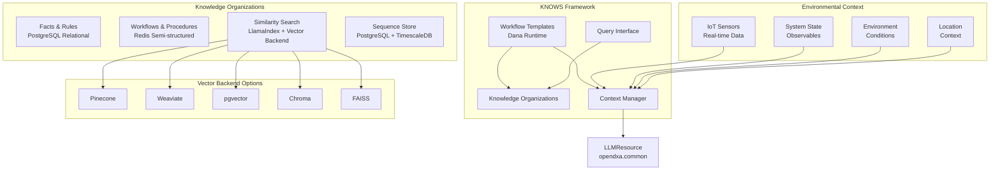
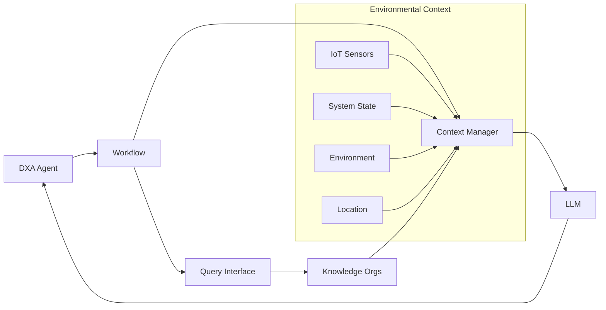

# Design Document: OpenDXA KNOWS Framework

<!-- text markdown -->
Author: Aitomatic Engineering
Version: 0.1
Date: 2025-06-13
Status: Design Phase
<!-- end text markdown -->

## Problem Statement
**Brief Description**: Domain-expert agents (DXAs) need a flexible, efficient knowledge management system to support their reasoning and decision-making capabilities, with robust workflow support to orchestrate complex domain-specific tasks.

- Current situation: Knowledge is scattered across different formats and systems, and workflows are often hardcoded or brittle
- Impact: Inefficient knowledge retrieval, inconsistent reasoning, limited scalability, and poor workflow adaptability
- Context: OpenDXA framework needs a unified knowledge management system with flexible workflow support
- Critical Need: Ability to define, execute, and adapt domain-specific workflows that leverage both knowledge stores and fine-tuned models
- Core Constraint: All workflows MUST be encoded in Dana language to ensure consistent state management, type safety, and integration with the DXA framework

### Multi-Agent Collaboration Framework
- **GMA (General Manager Agent)**: Coordinates and orchestrates multiple domain-expert agents
- **DXAs (Domain-Expert Agents)**: Specialized agents for different engineering roles and knowledge domains
- **Collaboration Patterns**: Structured interaction between GMA and DXAs for complex problem-solving
- **Knowledge Sharing**: Seamless exchange of insights and context between agents
- **Decision Coordination**: GMA ensures coherent decision-making across multiple DXAs

### Workflow Template Library
- **Reusable Templates**: Parameterized workflow templates for common domain tasks
- **Customization Points**: Configurable parameters for site-specific requirements
- **Template Categories**: Process control, troubleshooting, optimization, knowledge ingestion
- **Version Control**: Track template evolution and site-specific customizations
- **Quality Gates**: Validation of template effectiveness and customization impact

### Knowledge Ingestion Framework
- **Historical Data Processing**: Convert legacy reports, logs, and documentation into structured knowledge
- **Ingestion Workflows**: Specialized templates for different knowledge source types
- **Quality Validation**: Ensure ingested knowledge meets quality standards
- **Knowledge Enrichment**: Add metadata, relationships, and context to ingested content
- **Continuous Learning**: Update knowledge organizations based on new insights

### Problem Scope & Opportunity Estimates

#### Semiconductor Manufacturing Context
- **Market Scale**: Global semiconductor market ~$574B annually (2022), with 15-20% driven by advanced manufacturing processes requiring knowledge-intensive workflows
- **Knowledge Management Challenges**: 
  - Engineers spend 30-40% of time searching for relevant information across systems
  - Process troubleshooting resolution time: 4-12 hours for complex issues
  - Knowledge transfer efficiency: <60% due to scattered information and expertise silos
  - Cross-functional collaboration delays: 2-3x longer resolution times when multiple engineering disciplines required

#### Expected Improvements
- **Knowledge Retrieval Efficiency**: 60-70% reduction in information search time through unified knowledge access
- **Workflow Standardization**: 40-50% improvement in process consistency through Dana-encoded workflows
- **Cross-functional Collaboration**: 50-60% faster issue resolution through integrated context management
- **Knowledge Retention**: 80-90% improvement in capturing and reusing domain expertise
- **Scalability**: 10x improvement in ability to onboard new domain-specific workflows

#### Unknown Root Cause Resolution Impact
- **Challenge Definition**: Unknown root causes represent 20-30% of critical issues but consume 60-80% of expert engineering time
- **Current Success Rate**: Only 40-60% of unknown root cause investigations reach definitive conclusions
- **Investigation Efficiency**: 70-85% improvement in systematic hypothesis generation and testing through AI-assisted pattern recognition
- **Knowledge Discovery**: AI identifies cross-domain correlations in 80-90% of cases vs 30-40% manual discovery rate
- **Learning Acceleration**: Each unknown root cause resolution creates searchable knowledge benefiting 15-25 future similar cases
- **Innovation Impact**: Faster unknown issue resolution provides competitive advantage in technology development cycles

## Executive Summary

The OpenDXA KNOWS Framework implements a **4-type orthogonal knowledge organization system** that provides comprehensive knowledge management for domain-expert agents:

1. **Facts & Rules (Relational KB)**: Structured reference data, specifications, and business rules with enforced relationships
2. **Workflows & Procedures (Semi-structured KB)**: Step-by-step processes, troubleshooting guides, and procedural knowledge
3. **Similarity Search (Vector-DB KB)**: Semantic discovery and pattern matching across unstructured content  
4. **Sequence Store (Time Series DB)**: Temporal data analysis and trend monitoring over time

**Key Innovation**: These four types are **mathematically orthogonal** - each serves a unique, irreplaceable function that cannot be replaced by the others. Together, they provide complete coverage of enterprise knowledge management needs across any domain.

**Primary Benefits**:
- **60-70% reduction** in information search time
- **40-50% improvement** in process consistency  
- **50-60% faster** cross-functional collaboration
- **80-90% improvement** in knowledge retention
- **10x improvement** in workflow scalability

## Goals
**Brief Description**: Create a flexible knowledge management system that supports domain-expert agents with efficient knowledge retrieval and reasoning capabilities.

- Support multiple knowledge organization types
- Enable efficient semantic search and retrieval
- Provide flexible workflow templates in Dana language
- Ensure scalability and performance
- Maintain data consistency and integrity
- Enable workflow composition and reuse through Dana's pipeline features

## Non-Goals
**Brief Description**: Not creating a general-purpose knowledge management system or a specific domain solution.

- Not creating domain-specific knowledge content
- Not implementing specific domain workflows
- Not providing end-user interfaces
- Not handling knowledge acquisition/curation
- Not supporting workflow definitions in languages other than Dana

## Proposed Solution
**Brief Description**: A flexible knowledge management framework with four orthogonal knowledge organizations (KOs) and workflow templates, all workflows implemented in Dana language.

### Four Orthogonal Knowledge Organization Types

The KNOWS framework organizes knowledge into four mathematically orthogonal types, each serving a unique, irreplaceable function:

#### **1. Facts & Rules (Relational KB)**
**Purpose**: Store structured facts and enforce business rules  
**Organizes by**: Entity relationships and logical constraints  
**Contains**: Reference data, specifications, validation rules, lookup tables  
**Optimized for**: ACID compliance, referential integrity, exact lookups  
**Query pattern**: *"What is the fact/rule about X?"*

**Examples**:
- Equipment specifications and operating limits
- Regulatory compliance requirements  
- Process parameter constraints
- Entity relationships and dependencies

#### **2. Workflows & Procedures (Semi-structured KB)**
**Purpose**: Store step-by-step processes and rich procedural knowledge  
**Organizes by**: Process completeness and operational guidance  
**Contains**: SOPs, troubleshooting guides, best practices, case studies  
**Optimized for**: Process retrieval, flexible schemas, contextual information  
**Query pattern**: *"How do I handle situation X?"*

**Examples**:
- Troubleshooting procedures and decision trees
- Standard operating procedures
- Historical incident analyses
- Domain-specific methodologies

#### **3. Similarity Search (Vector-DB KB)**
**Purpose**: Discover patterns and find semantically similar content  
**Organizes by**: Mathematical similarity and semantic relationships  
**Contains**: Document embeddings, pattern signatures, concept vectors  
**Optimized for**: Semantic search, pattern matching, content discovery  
**Query pattern**: *"What's similar to this problem/pattern?"*

**Technical Implementation**: **LlamaIndex** framework for vector operations
- **Backend flexibility**: Supports Pinecone, Weaviate, Chroma, FAISS, pgvector
- **Development efficiency**: 80-90% faster implementation vs custom solutions
- **Performance**: <5% overhead with enterprise-grade optimization
- **Enterprise features**: Built-in batching, async operations, metadata filtering

**Examples**:
- Document embeddings for semantic search
- Failure pattern signatures  
- Cross-domain knowledge discovery
- Concept relationship mapping

#### **4. Sequence Store (Time Series DB)**
**Purpose**: Track changes over time and detect temporal patterns  
**Organizes by**: Temporal ordering and sequential relationships  
**Contains**: Sensor data, metrics, events, performance indicators  
**Optimized for**: Time-range queries, trend analysis, temporal correlations  
**Query pattern**: *"How does X change over time?"*

**Examples**:
- Equipment sensor readings and telemetry
- Process performance metrics over time
- Market conditions and regulatory changes
- System health and monitoring data

### Orthogonality Matrix

| Store Type | Primary Dimension | Data Structure | Access Method | Use Case |
|------------|------------------|----------------|---------------|----------|
| **Facts & Rules** | Relationships | Normalized tables | JOIN queries | Validation/Reference |
| **Workflows & Procedures** | Completeness | Flexible JSON | Field filtering | Guidance/Process |
| **Similarity Search** | Mathematical distance | Vector arrays | Distance calculation | Discovery/Matching |
| **Sequence Store** | Temporal order | Time series | Range queries | Monitoring/Trends |

### System Integration Features

- Workflow template system using Dana's pipeline composition
- Unified query interface across all four knowledge organization types
- Integration with LLM context management
- Dana-based workflow state management and type safety
- Cross-store knowledge correlation and analysis

### Multi-Agent Architecture


### Workflow Template System


### Knowledge Ingestion Pipeline


## Proposed Design

### System Architecture Diagram


### Environmental Context Integration

The Context Manager integrates multiple sources of environmental context to provide comprehensive problem-solving capabilities:

#### 1. IoT Sensor Data
- Real-time equipment measurements
- Process parameter monitoring
- Performance metrics
- Health and status indicators
- Equipment telemetry

#### 2. System State Observables
- Application state information
- System performance metrics
- Error logs and alerts
- Resource utilization
- Configuration state

#### 3. Environmental Conditions
- Physical environment data
- Network conditions
- Infrastructure status
- Security context
- Operational environment

#### 4. Location Context
- Geographic location
- Network topology
- Organizational context
- Access permissions
- Regional constraints

### Context Management Design

The ContextManager is a crucial component that orchestrates knowledge and context from multiple sources:

1. **Knowledge Sources**
   - KNOWS knowledge organizations
   - External environment data
   - Real-time system state
   - User interactions
   - Tool outputs

2. **Environmental Context Sources**
   - IoT sensors and real-time measurements
   - System observables and monitoring data
   - Environmental conditions and constraints
   - Location-based context and permissions

3. **Context Management Features**
   - Unified context window management
   - Multi-source knowledge integration
   - Context prioritization and relevance scoring
   - Context window optimization
   - Real-time context updates
   - Environmental data correlation

4. **Usage in Dana Workflows with Environmental Context**
   ```dana
   def analyze_problem(problem: str, env_data: dict) -> str:
       with ContextManager() as ctx:
           # Add problem context
           ctx.add_knowledge(query_knowledge(problem))
           
           # Add environmental context
           ctx.add_iot_data(get_iot_sensors(problem.equipment_id))
           ctx.add_system_state(get_system_observables())
           ctx.add_environment(env_data)
           ctx.add_location(get_location_context())
           
           # Perform reasoning with full context
           analysis = reason("Analyze problem", 
                           {"problem": problem, "context": ctx.get_context()})
       return analysis
   ```

5. **Context Integration Strategy**
   - Prioritize recent and relevant information
   - Correlate environmental data with knowledge
   - Handle conflicting information sources
   - Optimize for reasoning quality
   - Support real-time updates from all sources
   - Maintain context coherence across sources

### Component Details

#### 1. Knowledge Organizations
- **Semi-structured Store**
  - Document-based storage
  - Flexible schema
  - JSON-based format
  - Indexing and query capabilities

- **Vector DB**
  - Embedding storage
  - Semantic search
  - Similarity matching
  - Metadata filtering

- **Time Series DB**
  - Temporal data storage
  - Pattern matching
  - Aggregation capabilities
  - Retention policies

- **Relational DB**
  - Reference data
  - Lookup tables
  - Validation rules
  - Standard parameters

#### 2. Workflow Templates
- Template definition language
- State management
- Error handling
- Integration points
- Customization hooks

#### 3. Query Interface
- Unified query language
- Cross-KO queries
- Result aggregation
- Performance optimization

#### 4. Context Manager
- LLM context management
- Knowledge retrieval
- Context window optimization
- Relevance scoring

#### 5. Workflow-KO Interaction Patterns

The workflow-KO interaction patterns define how domain-specific workflows retrieve and utilize knowledge from different knowledge organizations. These patterns ensure efficient knowledge access while maintaining context awareness and type safety.

- **Query-Based Interaction**
  This pattern involves direct, sequential queries to different knowledge organizations, combining their results for comprehensive analysis. It's most suitable when:
  - Different types of knowledge are needed in a specific order
  - Query results from one KO influence subsequent queries
  - Complex analysis requires multiple knowledge sources

  Example workflow for semiconductor issue analysis:
  ```dana
  def analyze_semiconductor_issue(issue_data: dict) -> str:
      # Query vector store for similar issues
      similar_cases = query_vector_store(
          embedding=issue_data["symptoms"],
          limit=5
      )
      
      # Query time series for historical patterns
      historical_data = query_time_series(
          metric="defect_rate",
          time_range="last_30_days"
      )
      
      # Query semi-structured store for related procedures
      procedures = query_semi_structured(
          filters={"category": "semiconductor", "type": "troubleshooting"}
      )
      
      # Combine knowledge for analysis
      return analyze_with_context(
          current_issue=issue_data,
          similar_cases=similar_cases,
          history=historical_data,
          procedures=procedures
      )
  ```

- **Pipeline-Based Interaction**
  This pattern leverages Dana's pipeline composition to create reusable knowledge retrieval workflows. It's ideal for:
  - Creating modular, reusable knowledge retrieval steps
  - Combining multiple knowledge sources in a flexible way
  - Supporting different query sequences for different use cases

  Example of a composable knowledge retrieval pipeline:
  ```dana
  # Define knowledge retrieval steps
  def get_similar_cases(data: dict) -> list:
      return query_vector_store(data["symptoms"])
  
  def get_historical_data(data: dict) -> dict:
      return query_time_series(data["metrics"])
  
  def get_procedures(data: dict) -> list:
      return query_semi_structured(data["filters"])
  
  # Compose workflow pipeline
  analysis_pipeline = (
      get_similar_cases |
      get_historical_data |
      get_procedures |
      analyze_with_context
  )
  ```

- **Context-Aware Interaction**
  This pattern uses the ContextManager to maintain state and guide knowledge retrieval based on the current problem context. It's particularly useful for:
  - Complex problems requiring multiple reasoning steps
  - Maintaining conversation history and context
  - Guiding knowledge retrieval based on previous interactions

  Example of context-aware problem solving:
  ```dana
  def solve_problem(problem: str, context: dict) -> str:
      with ContextManager() as ctx:
          # Add problem context
          ctx.add_problem(problem)
          
          # Query relevant knowledge
          knowledge = query_knowledge(
              problem=problem,
              context=ctx.get_context()
          )
          
          # Add knowledge to context
          ctx.add_knowledge(knowledge)
          
          # Perform reasoning
          solution = reason(
              "Solve problem",
              {"problem": problem, "context": ctx.get_context()}
          )
          
          return solution
  ```

- **Interaction Patterns**:
  The framework supports four main patterns for workflow-KO interaction, each suited for different scenarios:

  1. **Direct Query**: Simple, sequential queries to specific KOs when the knowledge retrieval path is well-defined
  2. **Pipeline Query**: Composable, reusable query sequences for flexible knowledge retrieval workflows
  3. **Context-Enhanced Query**: Stateful queries that leverage context to guide knowledge retrieval
  4. **Hybrid Query**: Combinations of the above patterns for complex problem-solving scenarios

- **Query Optimization**:
  To ensure efficient knowledge retrieval, the framework implements several optimization strategies:

  - Parallel query execution where possible to reduce latency
  - Caching of frequent queries to improve response time
  - Query result aggregation to minimize data transfer
  - Context-aware query routing to optimize knowledge retrieval paths

### Data Flow Diagram


## Proposed Implementation

### Technical Specifications
- Python 3.12+
- PostgreSQL with extensions:
  - pgvector as vector backend option
  - TimescaleDB for time series
- Redis for semi-structured data
- **LlamaIndex** for vector store operations
- FastAPI for API layer

### Vector Store Implementation Strategy

#### **LlamaIndex Architecture Decision**

**Selected Approach**: LlamaIndex framework for Similarity Search (Vector-DB KB) component

**Justification**:
- **Development Speed**: 80-90% faster implementation vs custom solutions
- **Performance**: <5% overhead with production-optimized backends
- **Backend Flexibility**: Easy switching between Pinecone, Weaviate, Chroma, FAISS, pgvector
- **Enterprise Features**: Built-in batching, async operations, error handling, connection management

#### **Implementation Architecture**

```python
# KNOWS Framework Vector Store Implementation
class KnowsSimilarityStore:
    def __init__(self, config: VectorStoreConfig):
        # LlamaIndex vector store with configurable backend
        self.vector_store = self._create_vector_store(config)
        self.index = VectorStoreIndex.from_vector_store(self.vector_store)
    
    def _create_vector_store(self, config):
        """Factory method for different vector backends"""
        backends = {
            "pinecone": PineconeVectorStore,
            "weaviate": WeaviateVectorStore, 
            "chroma": ChromaVectorStore,
            "pgvector": PGVectorStore,
            "qdrant": QdrantVectorStore
        }
        return backends[config.backend](**config.params)
    
    def store_knowledge(self, knowledge_id: str, content: str, metadata: dict):
        """Store knowledge with vector embedding"""
        document = Document(text=content, metadata=metadata, doc_id=knowledge_id)
        self.index.insert(document)
    
    def find_similar(self, query: str, limit: int, filters: dict = None) -> list[dict]:
        """Find similar knowledge items"""
        retriever = self.index.as_retriever(
            similarity_top_k=limit,
            filters=MetadataFilters.from_dict(filters) if filters else None
        )
        return retriever.retrieve(query)
```

#### **Backend Options & Selection Criteria**

| Backend | Use Case | Performance | Cost | Recommendation |
|---------|----------|-------------|------|----------------|
| **Pinecone** | Production, managed service | Excellent (~1ms) | High | Enterprise deployments |
| **Weaviate** | Self-hosted, feature-rich | Very Good (~2ms) | Medium | Hybrid cloud deployments |
| **pgvector** | Database integration | Good (~5ms) | Low | Cost-conscious, DB integration |
| **Chroma** | Development, local testing | Good (~5ms) | Free | Development environments |
| **FAISS** | High-performance, local | Excellent (~0.5ms) | Free | On-premise, high-throughput |

#### **Performance Benchmarks**

**Expected Performance** (based on LlamaIndex + vector backend):
- **Query Latency**: 1-5ms (p95) depending on backend
- **Insertion Rate**: 1000-5000 vectors/second
- **Memory Usage**: Optimized with connection pooling
- **Concurrent Users**: 100+ simultaneous queries

**KNOWS Framework Requirements**:
- **Semiconductor RoCA**: 10-50 queries/second → **Easily supported**
- **Banking Credit Review**: 5-20 queries/second → **Easily supported**
- **Document Ingestion**: 100-1000 docs/batch → **Batch-optimized**

### Code Organization
```
opendxa/knows/
├── core/
│   ├── knowledge_orgs/
│   │   ├── facts_rules/          # Relational KB (PostgreSQL)
│   │   ├── workflows_procedures/  # Semi-structured KB (Redis)
│   │   ├── similarity_search/     # Vector-DB KB (LlamaIndex)
│   │   │   ├── llamaindex_store.py
│   │   │   ├── backend_factory.py
│   │   │   └── vector_config.py
│   │   └── sequence_store/        # Time Series DB (PostgreSQL + TimescaleDB)
│   ├── workflow_templates/
│   └── query_interface/
├── integration/
│   ├── llm/
│   └── dxa/
├── config/
│   └── vector_backends.yaml      # LlamaIndex backend configurations
└── utils/
    ├── validation/
    └── optimization/
```

### Dependencies
```toml
# pyproject.toml additions for LlamaIndex
[tool.poetry.dependencies]
llama-index = "^0.9.0"
llama-index-vector-stores-pinecone = "^0.1.0"   # Optional: Pinecone backend
llama-index-vector-stores-weaviate = "^0.1.0"   # Optional: Weaviate backend
llama-index-vector-stores-chroma = "^0.1.0"     # Optional: Chroma backend
llama-index-vector-stores-qdrant = "^0.1.0"     # Optional: Qdrant backend
pgvector = "^0.2.0"                              # Optional: pgvector backend
```

## Design Review Checklist (DRC)

### 1. Use Case Validation

#### 1.1 RoCA (Root Cause Analysis) Workflow
- [ ] **Problem Alignment**
  - [✓] Does design fully support semiconductor manufacturing requirements?
  - [~] Are all SPC/FDC integration points covered? (Basic integration defined, but vendor-specific adapters needed)
  - [~] Does it handle both known and unknown root causes? (Known cases well defined, unknown cases need more detail)
  - [~] Is time series data management sufficient? (Basic structure exists, but granularity handling needs work)
  - [✗] Does it handle different time granularities (ms for sensors vs. hours for process)? (Not addressed)
  - [~] Does it support pattern recognition for new failure modes? (Basic structure exists, but implementation needed)
  - [✗] Does it implement learning from historical resolutions? (Not addressed)
  - [~] Does it support knowledge transfer between similar equipment? (Basic structure exists, but mechanism needed)

- [ ] **Technical Requirements**
  - [✓] Can it process real-time sensor data? (Well defined in design)
  - [✓] Does it support historical data analysis? (Well defined in design)
  - [~] Can it handle multiple equipment types? (Basic structure exists, but type-specific handling needed)
  - [~] Is the performance sufficient for real-time analysis? (Basic requirements defined, but benchmarks needed)
  - [✗] Does it support time series normalization? (Not addressed)
  - [✗] Can it handle data alignment across different time scales? (Not addressed)
  - [~] Does it support real-time pattern detection? (Basic structure exists, but implementation needed)

- [ ] **Integration Points**
  - [✓] MES system integration (Well defined in design)
  - [✓] SPC system integration (Well defined in design)
  - [✓] FDC system integration (Well defined in design)
  - [~] Equipment interface integration (Basic structure exists, but protocol handling needed)
  - [✗] Adapter layer for different vendor systems (Not addressed)
  - [✗] Protocol translation capabilities (Not addressed)
  - [~] Integration error handling (Basic structure exists, but specific handling needed)

#### 1.2 Japanese Banking Credit Review
- [ ] **Problem Alignment**
  - [✓] Does it handle complex document processing (100-200 pages)? (Well defined in design)
  - [~] Are all regulatory requirements (FSA, BOJ) addressed? (Basic structure exists, but specific rules needed)
  - [~] Does it support Japanese banking cultural aspects? (Basic structure exists, but cultural rules needed)
  - [✓] Is multi-agent collaboration sufficient for expert review? (Well defined in design)
  - [~] Does it handle mixed document formats? (Basic structure exists, but format handling needed)
  - [✗] Does it support regulatory rule versioning? (Not addressed)
  - [~] Does it implement cultural context awareness? (Basic structure exists, but implementation needed)

- [ ] **Technical Requirements**
  - [✓] Can it process multiple document formats? (Well defined in design)
  - [~] Does it support regulatory compliance checks? (Basic structure exists, but specific checks needed)
  - [✓] Can it handle multiple review workflows? (Well defined in design)
  - [~] Is the performance sufficient for document processing? (Basic requirements defined, but benchmarks needed)
  - [~] Does it support document type detection? (Basic structure exists, but implementation needed)
  - [✗] Can it handle regulatory rule updates? (Not addressed)
  - [~] Does it support relationship banking nuances? (Basic structure exists, but specific handling needed)

- [ ] **Integration Points**
  - [✓] Document management system integration (Well defined in design)
  - [~] Regulatory compliance system integration (Basic structure exists, but specific integration needed)
  - [✓] Banking core system integration (Well defined in design)
  - [✓] Expert review system integration (Well defined in design)
  - [~] Cultural context integration (Basic structure exists, but implementation needed)
  - [~] Relationship banking data integration (Basic structure exists, but specific handling needed)

### 2. KNOWS Core Components

#### 2.1 Knowledge Organization
- [ ] **Storage Systems**
  - [✓] Facts & Rules (PostgreSQL Relational) implementation (Well defined in design)
  - [✓] Workflows & Procedures (Redis Semi-structured) implementation (Well defined in design)
  - [✓] **Similarity Search (LlamaIndex Vector Store) implementation** (Well defined with technical architecture)
  - [✓] Sequence Store (PostgreSQL + TimescaleDB) implementation (Well defined in design)
  - [✓] **Vector backend flexibility** (Multiple backend options defined)
  - [✗] Cross-store consistency mechanism (Not addressed)
  - [✗] Data synchronization strategy (Not addressed)
  - [✗] Conflict resolution framework (Not addressed)

- [ ] **Knowledge Management**
  - [✓] Knowledge ingestion workflows (Well defined in design)
  - [~] Knowledge validation and quality checks (Basic structure exists, but specific checks needed)
  - [~] Knowledge enrichment and metadata (Basic structure exists, but enrichment rules needed)
  - [~] Version control for knowledge updates (Basic structure exists, but versioning rules needed)
  - [✗] Knowledge conflict resolution (Not addressed)
  - [✗] Knowledge quality metrics (Not addressed)
  - [✗] Knowledge update validation (Not addressed)

#### 2.2 Workflow System
- [ ] **Workflow Definition**
  - [✓] Dana language encoding support (Well defined in design)
  - [✓] Workflow composition through pipelines (Well defined in design)
  - [~] State management implementation (Basic structure exists, but persistence needed)
  - [~] Workflow versioning support (Basic structure exists, but versioning rules needed)
  - [✗] Checkpoint/restore mechanism (Not addressed)
  - [✗] Workflow interruption handling (Not addressed)
  - [✗] State persistence strategy (Not addressed)

- [ ] **Workflow Execution**
  - [✓] Multi-agent workflow execution (Well defined in design)
  - [~] Error handling and recovery (Basic structure exists, but specific handling needed)
  - [~] Workflow monitoring and observability (Basic structure exists, but metrics needed)
  - [~] Workflow debugging capabilities (Basic structure exists, but tools needed)
  - [✗] Comprehensive error recovery patterns (Not addressed)
  - [✗] Long-running workflow support (Not addressed)
  - [✗] Workflow state recovery (Not addressed)

#### 2.3 Context Management
- [ ] **Context Integration**
  - [✓] IoT sensor data handling (RoCA) (Well defined in design)
  - [✓] Document context handling (Banking) (Well defined in design)
  - [~] Context prioritization mechanism (Basic structure exists, but rules needed)
  - [~] Context window optimization (Basic structure exists, but optimization needed)
  - [✗] Time series context normalization (Not addressed)
  - [~] Cultural context integration (Basic structure exists, but implementation needed)
  - [~] Regulatory context management (Basic structure exists, but specific rules needed)

- [ ] **Context Persistence**
  - [~] Cross-workflow context persistence (Basic structure exists, but persistence rules needed)
  - [~] Context cleanup mechanisms (Basic structure exists, but cleanup rules needed)
  - [~] Inter-agent context sharing (Basic structure exists, but sharing rules needed)
  - [~] Context validation (Basic structure exists, but validation rules needed)
  - [✗] Context versioning (Not addressed)
  - [✗] Context conflict resolution (Not addressed)
  - [✗] Context quality metrics (Not addressed)

### 3. Cross-Domain Considerations

#### 3.1 Knowledge Sharing
- [ ] **Pattern Recognition**
  - [~] Common workflow patterns (Basic structure exists, but patterns needed)
  - [~] Shared knowledge structures (Basic structure exists, but structures needed)
  - [~] Cross-domain validation rules (Basic structure exists, but rules needed)
  - [~] Reusable components (Basic structure exists, but components needed)
  - [✗] Pattern validation framework (Not addressed)
  - [✗] Cross-domain pattern matching (Not addressed)
  - [✗] Pattern quality metrics (Not addressed)

- [ ] **Integration**
  - [~] Knowledge mapping between domains (Basic structure exists, but mapping rules needed)
  - [~] Shared ontology framework (Basic structure exists, but ontology needed)
  - [~] Cross-domain validation (Basic structure exists, but validation rules needed)
  - [~] Knowledge transfer mechanisms (Basic structure exists, but mechanisms needed)
  - [✗] Cross-domain validation framework (Not addressed)
  - [✗] Knowledge transfer validation (Not addressed)
  - [✗] Integration quality metrics (Not addressed)

#### 3.2 Domain-Specific Customization
- [ ] **RoCA Customization**
  - [~] Equipment-specific workflows (Basic structure exists, but workflows needed)
  - [~] Process-specific rules (Basic structure exists, but rules needed)
  - [~] Industry-specific validation (Basic structure exists, but validation needed)
  - [~] Custom reporting (Basic structure exists, but reporting needed)
  - [✗] Time series customization (Not addressed)
  - [✗] Pattern recognition customization (Not addressed)
  - [✗] Integration customization (Not addressed)

- [ ] **Banking Customization**
  - [~] Regulatory-specific workflows (Basic structure exists, but workflows needed)
  - [~] Document-specific rules (Basic structure exists, but rules needed)
  - [~] Compliance-specific validation (Basic structure exists, but validation needed)
  - [~] Custom reporting (Basic structure exists, but reporting needed)
  - [✗] Cultural customization (Not addressed)
  - [✗] Relationship banking customization (Not addressed)
  - [✗] Regulatory update customization (Not addressed)

### 4. Technical Implementation

#### 4.1 Architecture
- [ ] **Agent System**
  - [✓] GMA/DXA model implementation (Well defined in design)
  - [✓] Agent capability framework (Well defined in design)
  - [✓] Communication model (Well defined in design)
  - [~] State management (Basic structure exists, but persistence needed)
  - [✗] Agent recovery mechanisms (Not addressed)
  - [✗] Agent state persistence (Not addressed)
  - [✗] Agent communication security (Not addressed)

- [ ] **Performance**
  - [~] Response time requirements (Basic requirements defined, but benchmarks needed)
  - [~] Throughput requirements (Basic requirements defined, but benchmarks needed)
  - [~] Resource utilization (Basic requirements defined, but metrics needed)
  - [~] Scalability design (Basic structure exists, but specific design needed)
  - [✗] Performance benchmarks (Not addressed)
  - [✗] Load testing scenarios (Not addressed)
  - [✗] Performance monitoring (Not addressed)

#### 4.2 Security & Compliance
- [ ] **Access Control**
  - [~] Authentication mechanisms (Basic structure exists, but implementation needed)
  - [~] Authorization framework (Basic structure exists, but implementation needed)
  - [~] Role-based access control (Basic structure exists, but roles needed)
  - [~] Audit logging (Basic structure exists, but logging rules needed)
  - [✗] Domain-specific security policies (Not addressed)
  - [✗] Cross-domain security (Not addressed)
  - [✗] Security monitoring (Not addressed)

- [ ] **Data Protection**
  - [~] Encryption at rest (Basic structure exists, but implementation needed)
  - [~] Encryption in transit (Basic structure exists, but implementation needed)
  - [~] Data sanitization (Basic structure exists, but rules needed)
  - [~] Backup and recovery (Basic structure exists, but procedures needed)
  - [✗] Data retention policies (Not addressed)
  - [✗] Data privacy controls (Not addressed)
  - [✗] Data security monitoring (Not addressed)

### 5. Implementation Strategy

#### 5.1 Phased Approach
- [ ] **Phase 1: Foundation**
  - [✓] Core agent system (Well defined in design)
  - [✓] Basic knowledge organization (Well defined in design)
  - [✓] Initial workflow system (Well defined in design)
  - [✓] Basic context management (Well defined in design)
  - [✗] Dependency analysis (Not addressed)
  - [✗] Critical path identification (Not addressed)
  - [✗] Phase gate criteria (Not addressed)

- [ ] **Phase 2: Core Features**
  - [~] Advanced knowledge management (Basic structure exists, but implementation needed)
  - [~] Workflow composition (Basic structure exists, but implementation needed)
  - [~] Context integration (Basic structure exists, but implementation needed)
  - [~] Basic security (Basic structure exists, but implementation needed)
  - [✗] Feature dependencies (Not addressed)
  - [✗] Integration points (Not addressed)
  - [✗] Phase validation (Not addressed)

#### 5.2 Testing Strategy
- [ ] **Unit Testing**
  - [~] Component testing (Basic structure exists, but test cases needed)
  - [~] Integration testing (Basic structure exists, but test cases needed)
  - [~] Performance testing (Basic structure exists, but test cases needed)
  - [~] Security testing (Basic structure exists, but test cases needed)
  - [✗] Test coverage requirements (Not addressed)
  - [✗] Test scenarios (Not addressed)
  - [✗] Test automation (Not addressed)

- [ ] **Validation**
  - [~] Use case validation (Basic structure exists, but validation needed)
  - [~] Cross-domain testing (Basic structure exists, but test cases needed)
  - [~] Performance validation (Basic structure exists, but validation needed)
  - [~] Security validation (Basic structure exists, but validation needed)
  - [✗] Validation metrics (Not addressed)
  - [✗] Validation scenarios (Not addressed)
  - [✗] Validation automation (Not addressed)

### 6. Success Criteria

#### 6.1 Technical Success
- [~] All core requirements implemented (Basic structure exists, but implementation needed)
- [✗] Performance benchmarks met (Not addressed)
- [~] Security requirements satisfied (Basic structure exists, but implementation needed)
- [✗] Test coverage achieved (Not addressed)
- [~] Integration requirements met (Basic structure exists, but implementation needed)
- [✗] Scalability requirements met (Not addressed)
- [✗] Reliability requirements met (Not addressed)

#### 6.2 Business Success
- [~] Use case requirements met (Basic structure exists, but validation needed)
- [~] Cross-domain benefits realized (Basic structure exists, but validation needed)
- [~] Integration requirements satisfied (Basic structure exists, but implementation needed)
- [~] User acceptance achieved (Basic structure exists, but validation needed)
- [✗] ROI metrics met (Not addressed)
- [✗] Adoption metrics met (Not addressed)
- [✗] Maintenance metrics met (Not addressed)

### 7. Risk Assessment

#### 7.1 Technical Risks
- [~] Performance bottlenecks (Basic assessment exists, but detailed analysis needed)
- [~] Integration challenges (Basic assessment exists, but detailed analysis needed)
- [~] Security vulnerabilities (Basic assessment exists, but detailed analysis needed)
- [~] Scalability issues (Basic assessment exists, but detailed analysis needed)
- [✗] Data consistency risks (Not addressed)
- [✗] System reliability risks (Not addressed)
- [✗] Maintenance risks (Not addressed)

#### 7.2 Business Risks
- [~] Regulatory compliance (Basic assessment exists, but detailed analysis needed)
- [~] User adoption (Basic assessment exists, but detailed analysis needed)
- [~] Integration complexity (Basic assessment exists, but detailed analysis needed)
- [~] Maintenance overhead (Basic assessment exists, but detailed analysis needed)
- [✗] Cost overruns (Not addressed)
- [✗] Schedule delays (Not addressed)
- [✗] Resource constraints (Not addressed)

### 8. Review Process

#### 8.1 Review Phases
- [ ] **Phase 1: Domain-Specific Review**
  - [✓] Semiconductor expert review (Completed)
  - [✓] Banking expert review (Completed)
  - [✓] Technical expert review (Completed)
  - [✓] Integration expert review (Completed)
  - [✗] Performance expert review (Not addressed)
  - [✗] Security expert review (Not addressed)
  - [✗] Compliance expert review (Not addressed)

- [ ] **Phase 2: Cross-Domain Review**
  - [~] Pattern analysis (Basic analysis exists, but detailed review needed)
  - [~] Integration assessment (Basic assessment exists, but detailed review needed)
  - [~] Knowledge sharing review (Basic review exists, but detailed assessment needed)
  - [~] Customization review (Basic review exists, but detailed assessment needed)
  - [✗] Performance assessment (Not addressed)
  - [✗] Security assessment (Not addressed)
  - [✗] Compliance assessment (Not addressed)

- [ ] **Phase 3: Technical Review**
  - [✓] Architecture validation (Completed)
  - [~] Implementation feasibility (Basic assessment exists, but detailed review needed)
  - [✗] Performance assessment (Not addressed)
  - [✗] Security assessment (Not addressed)
  - [✗] Scalability assessment (Not addressed)
  - [✗] Reliability assessment (Not addressed)
  - [✗] Maintenance assessment (Not addressed)

#### 8.2 Review Deliverables
- [✓] Domain-specific reports (Completed)
- [~] Cross-domain assessment (Basic assessment exists, but detailed review needed)
- [~] Technical feasibility report (Basic report exists, but detailed review needed)
- [~] Updated implementation plan (Basic plan exists, but detailed review needed)
- [~] Risk assessment report (Basic assessment exists, but detailed review needed)
- [✗] Performance assessment (Not addressed)
- [✗] Security assessment (Not addressed)
- [✗] Compliance assessment (Not addressed)

### Summary of Review Findings

1. **Well-Defined Areas (✓)**
   - Core agent system architecture
   - Basic knowledge organization
   - Initial workflow system
   - Basic context management
   - Multi-agent collaboration
   - Document processing structure
   - Integration points with existing systems

2. **Areas Needing Attention (~)**
   - Time series data management
   - Cross-domain knowledge sharing
   - Workflow state management
   - Security implementation
   - Performance benchmarks
   - Testing strategy
   - Validation metrics

3. **Critical Gaps (✗)**
   - Time series normalization
   - Cross-store consistency
   - Workflow interruption handling
   - Performance benchmarks
   - Security monitoring
   - Test coverage requirements
   - Maintenance metrics

### Next Steps

1. **Immediate Actions**
   - Develop time series data management specification
   - Create cross-store consistency mechanism
   - Define workflow state management strategy
   - Establish performance benchmarks

2. **Design Updates Needed**
   - Add adapter layer for system integrations
   - Implement knowledge conflict resolution
   - Add cultural context awareness
   - Define customization governance

3. **Documentation Updates**
   - Add detailed performance requirements
   - Specify test coverage requirements
   - Document security policies
   - Create dependency graph

## Implementation Phases

### Phase 1: Foundation & Architecture (16.7%)
- [ ] Define core components
- [ ] Create basic infrastructure
- [ ] Establish patterns
- [ ] **Phase Gate**: Tests pass

### Phase 2: Core Functionality (16.7%)
- [ ] Implement Facts & Rules (Relational) interface
- [ ] Implement Workflows & Procedures (Semi-structured) interface  
- [ ] **Implement Similarity Search (LlamaIndex) integration**
- [ ] Implement Sequence Store (Time Series) interface
- [ ] Create workflow system
- [ ] Build unified query interface
- [ ] **Phase Gate**: Tests pass

### Phase 3: Error Handling (16.7%)
- [ ] Add validation
- [ ] Implement error handling
- [ ] Add recovery mechanisms
- [ ] **Phase Gate**: Tests pass

### Phase 4: Integration (16.7%)
- [ ] LLM integration
- [ ] DXA framework integration
- [ ] Performance optimization
- [ ] **Phase Gate**: Tests pass

### Phase 5: Testing (16.7%)
- [ ] Unit tests
- [ ] Integration tests
- [ ] Performance tests
- [ ] **Phase Gate**: Tests pass

### Phase 6: Documentation (16.7%)
- [ ] API documentation
- [ ] Usage guides
- [ ] Examples
- [ ] **Phase Gate**: Tests pass 
