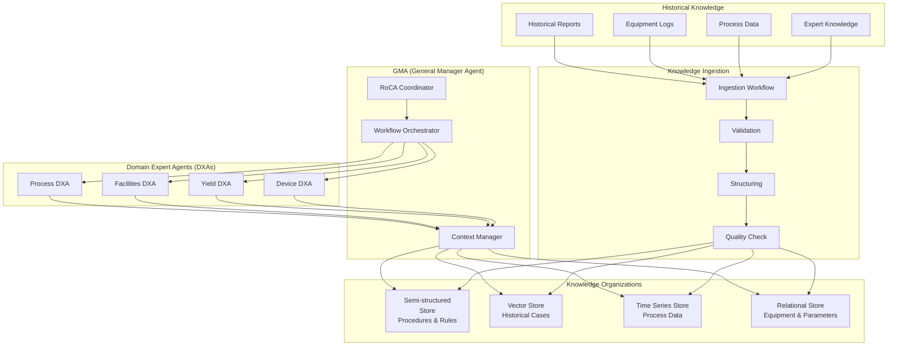
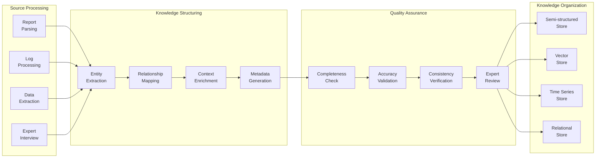
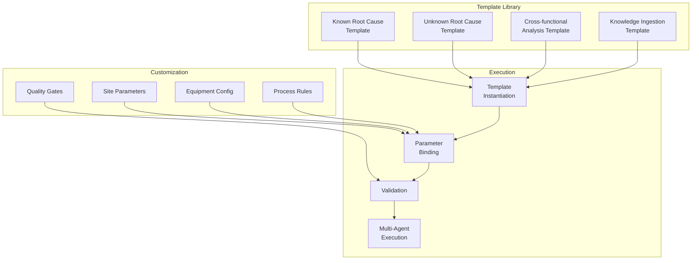
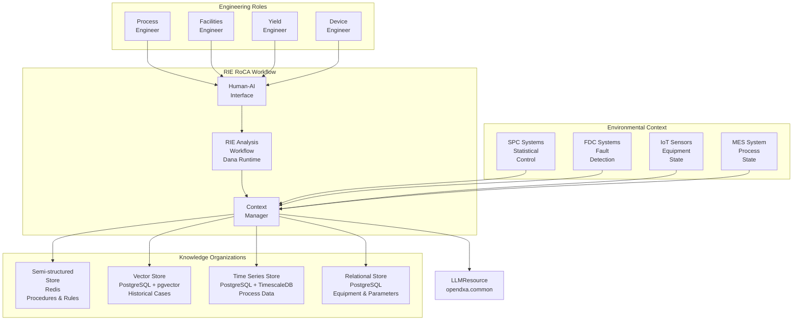
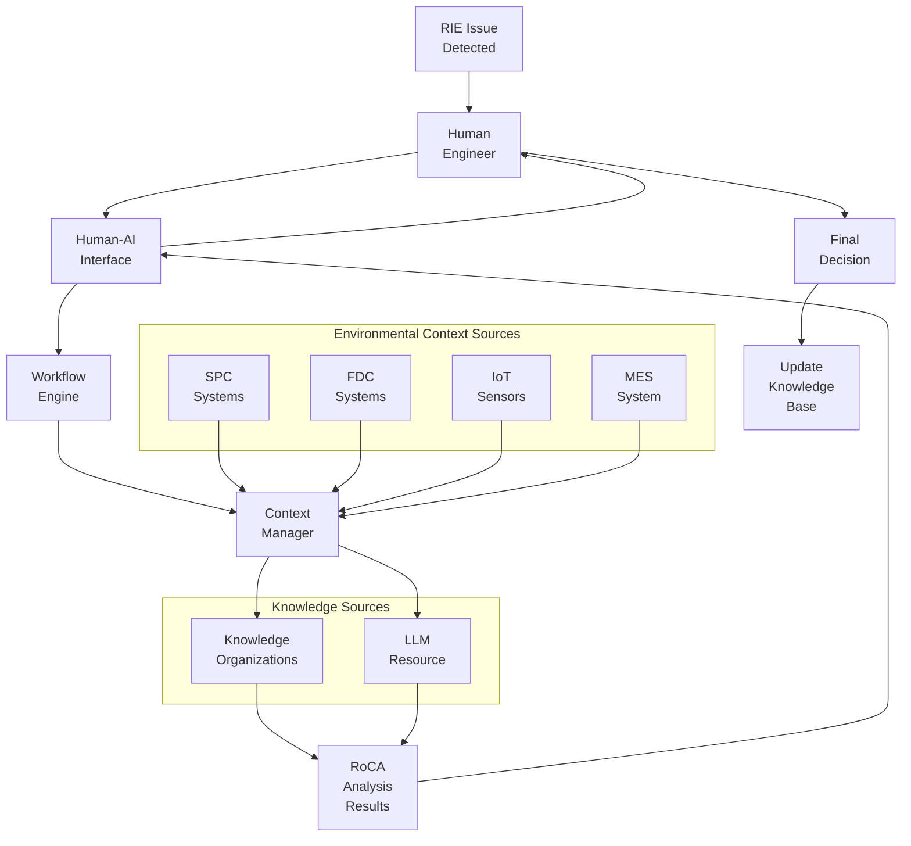

# Design Document: RIE Root of Cause Analysis (RoCA) Workflow

<!-- text markdown -->
Author: Aitomatic Engineering
Version: 0.2
Date: 2025-06-13
Status: Design Phase
<!-- end text markdown -->

## Problem Statement
**Brief Description**: Semiconductor manufacturers need an AI-aided, knowledge-driven approach to analyze and resolve RIE process issues, integrating with existing SPC/FDC systems and supporting various engineering roles in both known and unknown root cause scenarios.

- Current situation: RIE process issues are analyzed manually by different engineering teams (process, facilities, yield, device engineers) using separate tools and scattered knowledge
- Impact: Long resolution times, inconsistent analysis across teams, knowledge silos, missed correlations between SPC/FDC data and root causes
- Context: RIE is a critical semiconductor manufacturing process where defects can significantly impact yield and quality, with complex interactions between equipment, process, and environmental factors
- Critical Need: AI-aided systematic approach to RoCA that enhances human engineering workflows while integrating with existing SPC/FDC infrastructure
- Core Constraint: Workflow must be encoded in Dana language for integration with DXA framework and support human-AI collaboration

### Historical Knowledge Integration
- **Legacy Reports**: Decades of RIE troubleshooting reports and root cause analyses
- **Knowledge Silos**: Critical insights trapped in PDFs, spreadsheets, and tribal knowledge
- **Pattern Recognition**: Historical patterns and solutions not systematically captured
- **Knowledge Loss**: Critical insights lost during engineer transitions
- **Integration Need**: Convert historical knowledge into structured, searchable KOs

### Multi-Agent RoCA Framework
- **GMA Coordination**: Orchestrates specialized DXAs for comprehensive analysis
- **Role-Specific DXAs**: Process, Facilities, Yield, and Device engineering agents
- **Collaborative Analysis**: DXAs work together under GMA guidance
- **Knowledge Sharing**: Seamless exchange of insights between agents
- **Decision Integration**: Unified recommendations from multiple perspectives

### RIE Process Challenge & Opportunity Estimates

#### Current State Metrics
- **RIE Process Criticality**: 30-40% of critical etch steps in advanced semiconductor manufacturing
- **Yield Impact**: RIE defects can cause 2-15% yield loss depending on process node and device type
- **Downtime Cost**: $500K-$2M per day per fab line for unplanned RIE equipment downtime
- **Issue Resolution Time**:
  - Known issues: 2-4 hours (with experienced engineers)
  - Unknown issues: 8-48 hours (requiring cross-functional investigation)
  - Complex issues: 1-3 days (involving multiple engineering teams)

#### Engineer Time Allocation (Current State)
- **Process Engineers**: 40-50% time on troubleshooting, 20% on data correlation across systems
- **Facilities Engineers**: 35-45% time on equipment diagnostics, 25% on utilities correlation
- **Yield Engineers**: 30-40% time on defect correlation, 30% on cross-lot analysis
- **Device Engineers**: 25-35% time on electrical correlation to process issues

#### Financial Impact Estimates
- **Annual RIE-related Yield Loss**: $50-200M per major fab (300mm, advanced nodes)
- **Engineering Time Cost**: $2-5M annually per fab in engineer time for RIE troubleshooting
- **Knowledge Loss**: 30-40% of tribal knowledge lost during engineer transitions/retirements
- **Cross-training Cost**: $100K-$300K per engineer to reach expert-level RIE troubleshooting capability

#### Expected Improvements with KNOWS Framework
- **Issue Resolution Time**: 50-70% reduction through AI-aided pattern recognition and knowledge integration
- **First-Time Resolution Rate**: Increase from 60% to 85% for known issue patterns
- **Cross-functional Collaboration**: 40-60% reduction in hand-off delays between engineering teams
- **Yield Recovery**: 20-30% faster yield recovery through systematic root cause analysis
- **Knowledge Retention**: 80-90% improvement in capturing and transferring RIE expertise
- **New Engineer Ramp-up**: 60-70% reduction in time to become effective at RIE troubleshooting
- **ROI Projection**: 300-500% ROI within 18 months based on yield improvement and time savings

#### Process Quality Metrics
- **Current RIE Process Capability**: Cpk 1.2-1.8 (depending on parameter)
- **Target Improvement**: Cpk 1.5-2.0 through better root cause understanding
- **Defect Reduction**: 30-50% reduction in RIE-related defects through proactive issue identification
- **Process Variation**: 20-30% reduction in process parameter variation through knowledge-driven optimization

#### Unknown Root Cause Impact Analysis

**Current State - Unknown Root Causes:**
- **Frequency**: 25-35% of RIE issues fall into "unknown root cause" category initially
- **Resolution Time**: 3-10x longer than known issues (24-120 hours vs 2-4 hours)
- **Success Rate**: Only 40-60% result in definitive root cause identification
- **Engineer Involvement**: Requires 3-5 engineers across disciplines vs 1-2 for known issues
- **Escalation Rate**: 60-80% require escalation to senior engineers or equipment vendors
- **Recurring Issues**: 30-40% of "resolved" unknown issues recur within 6 months

**Cost Impact - Unknown Root Causes:**
- **Disproportionate Impact**: Unknown issues cause 70-80% of total RIE troubleshooting costs despite being 25-35% of incidents
- **Extended Downtime**: Average 2-5 days of reduced productivity during investigation
- **Yield Loss Amplification**: 3-5x higher yield impact due to extended resolution time
- **Knowledge Gaps**: 50-70% of investigation insights not captured for future reference
- **Resource Drain**: Consume 60-70% of senior engineer time allocation

**KNOWS Framework Impact on Unknown Root Causes:**
- **Investigation Time**: 60-80% reduction through systematic hypothesis generation and testing
- **Pattern Recognition**: AI identifies subtle correlations missed by manual analysis (improve success rate from 50% to 75-80%)
- **Cross-domain Correlation**: 70-85% improvement in connecting process, equipment, and environmental factors
- **Knowledge Capture**: 90-95% of investigation insights systematically captured and searchable
- **Hypothesis Generation**: AI generates 5-10 testable hypotheses vs 2-3 from manual brainstorming
- **False Path Reduction**: 40-60% reduction in time spent investigating incorrect theories
- **Tribal Knowledge Access**: Instant access to similar historical cases across all fabs and time periods

**ROI Specifically from Unknown Root Cause Improvements:**
- **Primary ROI Driver**: Unknown root cause improvements account for 60-70% of total KNOWS framework ROI
- **Yield Recovery**: $5-15M annual recovery per fab from faster unknown issue resolution
- **Engineering Efficiency**: $1-3M annual savings in senior engineer time per fab
- **Knowledge Multiplier**: Each unknown root cause resolution benefits 10-20 future similar cases
- **Competitive Advantage**: Faster novel issue resolution provides 6-12 month technology leadership window

## Goals
**Brief Description**: Create an AI-aided RIE RoCA workflow that systematically analyzes process issues using multiple knowledge sources while supporting different engineering roles and known/unknown root cause scenarios.

- Integrate with existing SPC (Statistical Process Control) and FDC (Fault Detection and Classification) systems
- Support multiple engineering roles: process, facilities, yield, and device engineers
- Handle both known root cause patterns and unknown root cause discovery
- Enhance human engineering workflows with AI assistance
- Provide role-specific insights and recommendations
- Enable collaborative analysis across engineering teams
- Maintain and update RIE process knowledge continuously

## Non-Goals
**Brief Description**: Not replacing human engineering expertise or creating a fully autonomous system.

- Not replacing human engineers or their decision-making authority
- Not automating all aspects of RIE process control or equipment maintenance
- Not handling non-RIE semiconductor processes
- Not replacing existing SPC/FDC systems
- Not providing real-time process control (that's FDC's role)

## Proposed Solution
**Brief Description**: An AI-aided knowledge-driven RIE RoCA workflow that integrates with SPC/FDC systems, supports multiple engineering roles, and handles both known and unknown root cause scenarios through human-AI collaboration.

- Integration with existing SPC/FDC infrastructure
- Role-based workflow customization for different engineering disciplines
- Known vs unknown root cause classification and handling
- Human-AI collaborative analysis framework
- Structured knowledge organization for RIE processes
- Continuous learning from resolved cases

### Multi-Agent RoCA Architecture


### Historical Knowledge Ingestion Workflow


### RoCA Workflow Template System


## Proposed Design

### System Architecture Diagram


### Root Cause Classification Framework

#### 1. Known Root Cause Scenarios
Known root causes are patterns that have been previously identified, documented, and resolved:

- **Pattern Recognition**: Historical cases with similar symptoms and confirmed root causes
- **Solution Library**: Proven corrective actions and preventive measures
- **Confidence Scoring**: Statistical confidence based on pattern matching
- **Validation Process**: Human engineer confirmation of AI recommendations

#### 2. Unknown Root Cause Scenarios
Unknown root causes require investigative analysis and discovery:

- **Anomaly Detection**: Identification of novel patterns not seen before
- **Hypothesis Generation**: AI-assisted generation of potential root cause theories
- **Investigation Workflow**: Structured approach to gather additional data
- **Human-AI Collaboration**: Engineers guide investigation with AI assistance
- **Knowledge Capture**: Documentation of newly discovered root causes

### Engineering Role Integration

#### 1. Process Engineer Workflow
Focus on process parameters, recipes, and optimization:

```dana
def process_engineer_roca(issue: dict, engineer_context: dict) -> dict:
    with ContextManager() as ctx:
        # Add process-specific context
        ctx.add_process_data(get_process_parameters(issue))
        ctx.add_recipe_data(get_recipe_history(issue))
        ctx.add_spc_data(get_spc_trends(issue))
        
        # Check for known process-related root causes
        known_causes = query_vector_store(
            embedding=issue["symptoms"],
            filters={"domain": "process", "role": "process_engineer"}
        )
        
        if known_causes["confidence"] > 0.8:
            return handle_known_root_cause(known_causes)
        else:
            return investigate_unknown_root_cause(issue, "process")
```

#### 2. Facilities Engineer Workflow
Focus on equipment, utilities, and infrastructure:

```dana
def facilities_engineer_roca(issue: dict, engineer_context: dict) -> dict:
    with ContextManager() as ctx:
        # Add facilities-specific context
        ctx.add_equipment_data(get_equipment_state(issue))
        ctx.add_utilities_data(get_utilities_status(issue))
        ctx.add_fdc_data(get_fdc_alerts(issue))
        
        # Equipment health analysis
        equipment_analysis = analyze_equipment_health(issue)
        utilities_analysis = analyze_utilities_impact(issue)
        
        return combine_facilities_analysis(equipment_analysis, utilities_analysis)
```

#### 3. Yield Engineer Workflow
Focus on yield impact, trends, and correlations:

```dana
def yield_engineer_roca(issue: dict, engineer_context: dict) -> dict:
    with ContextManager() as ctx:
        # Add yield-specific context
        ctx.add_yield_data(get_yield_trends(issue))
        ctx.add_defect_data(get_defect_patterns(issue))
        ctx.add_test_data(get_test_results(issue))
        
        # Yield impact analysis
        yield_impact = analyze_yield_impact(issue)
        defect_correlation = correlate_defects_to_process(issue)
        
        return generate_yield_recommendations(yield_impact, defect_correlation)
```

#### 4. Device Engineer Workflow
Focus on device performance, electrical characteristics, and design impact:

```dana
def device_engineer_roca(issue: dict, engineer_context: dict) -> dict:
    with ContextManager() as ctx:
        # Add device-specific context
        ctx.add_device_data(get_device_parameters(issue))
        ctx.add_electrical_data(get_electrical_test_data(issue))
        ctx.add_design_data(get_design_rules(issue))
        
        # Device impact analysis
        device_impact = analyze_device_impact(issue)
        electrical_correlation = correlate_electrical_to_process(issue)
        
        return generate_device_recommendations(device_impact, electrical_correlation)
```

### Human-AI Collaboration Framework

#### 1. Current Human Workflow (Before AI)
Traditional engineering workflow for RoCA:

1. **Issue Detection**: Manual review of SPC/FDC alerts
2. **Data Gathering**: Manual collection from multiple systems
3. **Analysis**: Individual engineer analysis based on experience
4. **Collaboration**: Email/meeting coordination between teams
5. **Resolution**: Trial-and-error approach to solutions
6. **Documentation**: Manual documentation (often incomplete)

#### 2. AI-Aided Workflow (With KNOWS)
Enhanced workflow with AI assistance:

```dana
def collaborative_roca_workflow(issue: dict, engineer: str) -> dict:
    with ContextManager() as ctx:
        # Initialize collaborative session
        session = start_collaboration_session(issue, engineer)
        
        # AI provides initial analysis
        initial_analysis = analyze_issue_multi_perspective(issue)
        
        # Present findings to human engineer
        human_feedback = present_analysis_to_human(initial_analysis, engineer)
        
        # Refine analysis based on human input
        refined_analysis = refine_with_human_feedback(
            initial_analysis, 
            human_feedback
        )
        
        # Generate collaborative recommendations
        recommendations = generate_collaborative_recommendations(
            refined_analysis,
            engineer_expertise=engineer
        )
        
        # Human validation and decision
        final_decision = human_validate_recommendations(recommendations)
        
        # Update knowledge base
        update_knowledge_from_collaboration(session, final_decision)
        
        return final_decision
```

#### 3. Human-AI Interaction Patterns

**Pattern 1: AI-Initiated Analysis**
- AI detects potential issues from SPC/FDC data
- AI presents preliminary analysis to relevant engineers
- Engineers guide investigation based on AI insights

**Pattern 2: Human-Initiated Investigation**
- Engineer identifies issue and requests AI assistance
- AI provides relevant historical cases and analysis
- Engineer directs AI to explore specific hypotheses

**Pattern 3: Collaborative Hypothesis Testing**
- AI generates multiple hypotheses for unknown root causes
- Engineers select promising hypotheses for investigation
- AI assists in designing experiments to test hypotheses

### SPC/FDC Integration

#### 1. SPC Integration
Statistical Process Control integration for trend analysis:

```dana
def integrate_spc_analysis(issue: dict) -> dict:
    # Get SPC trend data
    spc_trends = get_spc_trends(
        parameters=issue["process_parameters"],
        time_range=issue["time_range"]
    )
    
    # Analyze control chart patterns
    pattern_analysis = analyze_control_patterns(spc_trends)
    
    # Correlate with historical issues
    correlations = correlate_spc_to_issues(pattern_analysis)
    
    return {
        "spc_trends": spc_trends,
        "patterns": pattern_analysis,
        "correlations": correlations
    }
```

#### 2. FDC Integration
Fault Detection and Classification integration for real-time alerts:

```dana
def integrate_fdc_analysis(issue: dict) -> dict:
    # Get FDC fault data
    fdc_faults = get_fdc_faults(
        equipment_id=issue["equipment_id"],
        time_range=issue["time_range"]
    )
    
    # Analyze fault patterns
    fault_analysis = analyze_fault_patterns(fdc_faults)
    
    # Map faults to potential root causes
    root_cause_mapping = map_faults_to_causes(fault_analysis)
    
    return {
        "fdc_faults": fdc_faults,
        "fault_patterns": fault_analysis,
        "potential_causes": root_cause_mapping
    }
```

### Data Flow Diagram


## Design Review Checklist
**Status**: [ ] Not Started | [x] In Progress | [ ] Complete

- [ ] Problem Alignment
- [ ] Goal Achievement
- [ ] Non-Goal Compliance
- [ ] KISS/YAGNI Compliance
- [ ] Security review
- [ ] Performance impact
- [ ] Error handling
- [ ] Testing strategy
- [ ] Documentation
- [ ] Backwards compatibility

## Implementation Phases

### Phase 1: Foundation & Architecture (16.7%)
- [ ] Define RIE knowledge structures
- [ ] Create human-AI interface framework
- [ ] Establish SPC/FDC integration patterns
- [ ] **Phase Gate**: Tests pass

### Phase 2: Core Functionality (16.7%)
- [ ] Implement known root cause handling
- [ ] Create role-specific workflows
- [ ] Build collaborative analysis framework
- [ ] **Phase Gate**: Tests pass

### Phase 3: Error Handling (16.7%)
- [ ] Add data validation for SPC/FDC
- [ ] Implement error handling for human interactions
- [ ] Add recovery mechanisms
- [ ] **Phase Gate**: Tests pass

### Phase 4: Integration (16.7%)
- [ ] SPC/FDC system integration
- [ ] Engineering tool integration
- [ ] Human-AI interface implementation
- [ ] **Phase Gate**: Tests pass

### Phase 5: Testing (16.7%)
- [ ] Unit tests for all components
- [ ] Integration tests with SPC/FDC
- [ ] Human-AI interaction testing
- [ ] **Phase Gate**: Tests pass

### Phase 6: Documentation (16.7%)
- [ ] Engineering user guides
- [ ] API documentation
- [ ] Training materials
- [ ] **Phase Gate**: Tests pass 