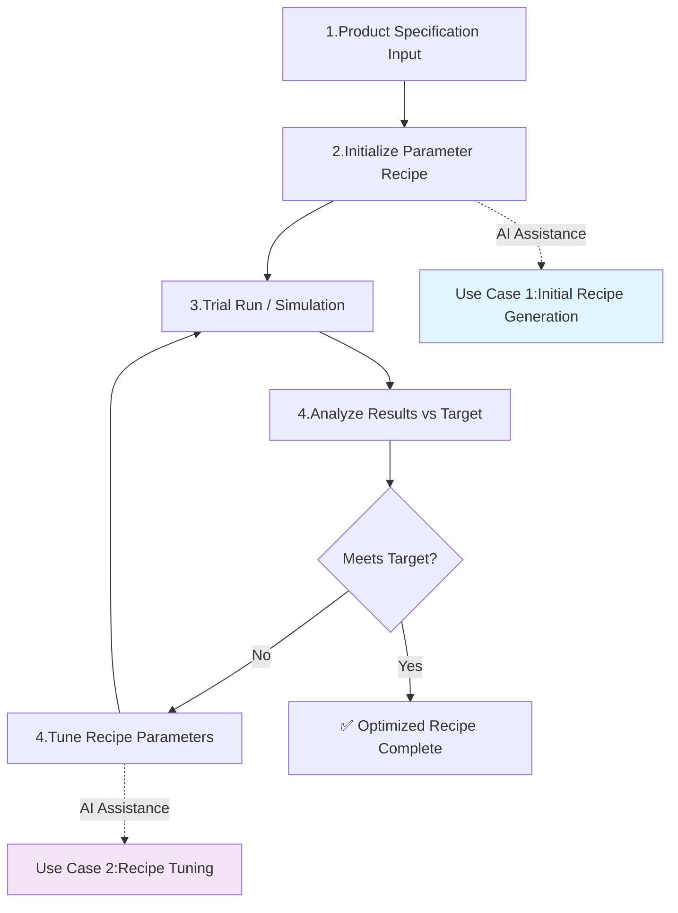

# Semiconductor Dispensing Optimization - AI Agent Evaluation

This evaluation framework tests AI agents' ability to assist Field Application Engineers (FAEs) in semiconductor dispensing parameter optimization workflows.

## 📋 Process Workflow Overview

The semiconductor dispensing optimization follows this iterative workflow:



## 🎯 AI Agent Evaluation Use Case

### **Use Case 1: Initial Recipe Generation** ⭐ *Current Focus*
**Scenario**: FAE receives product specifications and needs to generate initial dispensing parameters.

**AI Task**: Transform product requirements into executable dispensing recipe parameters.

**Input**: Product specification with target quality metrics
**Output**: Initial parameter recipe (vision, motion, dispensing settings)

**Evaluation Method**: Compare AI-generated recipes against validated reference solutions from historical optimization data.

### **Use Case 2: Recipe Tuning & Optimization** ⏸️ *Future Implementation*  
**Scenario**: FAE has trial results that don't meet targets and needs parameter adjustments.

**AI Task**: Analyze trial feedback and recommend parameter changes to achieve target specifications.

**Input**: Product specification + trial results + performance gap
**Output**: Adjusted parameter recipe to improve quality metrics

**Status**: Not yet implemented - focusing on Use Case 1 first.

---

## 📊 Evaluation Test Sets

### **Dataset Structure**
```
evaluate/
├── documents/                    # Historical optimization records (ground truth)
│   ├── bga256_emi_*.json        # BGA EMI shielding optimization
│   ├── csp15_underfill_*.json   # CSP underfill flow optimization  
│   ├── led_uv_cure_*.json       # LED UV coating optimization
│   └── ... (10 total records)   # Complete optimization sessions with trials
├── dispensing_optimization_testset.json  # Use Case 1 test cases (synthesized)
├── llm_judge_evaluation_guide.md         # LLM-as-Judge methodology  
└── README.md                    # This file
```

### **Test Set Relationship**

**Historical Records** (`documents/`) serve as **ground truth**:
- Complete 5-trial optimization sessions from semiconductor manufacturing
- Final trial parameters represent validated, successful recipes
- Contains realistic parameter progressions and quality improvements

**Test Set** (`dispensing_optimization_testset.json`) for **Use Case 1**:
- **Synthesized from historical record ground truth**
- **Input**: Extracted from initial trial conditions in each historical session
- **Expected Output**: Final successful parameters from completed optimization sessions  
- **Purpose**: Enables comparative evaluation of AI-generated vs. expert-validated recipes
- **Coverage**: 10 test cases across diverse applications (EMI, underfill, adhesive, thermal, etc.)

### **Test Case Format (Use Case 1)**
Each test case contains:
- **Input**: Product specifications and target requirements (from historical trial 1)
- **Expected Output**: Validated parameters and quality metrics (from historical final trial)
- **Source**: Derived from complete historical optimization session

---

## 🧪 Use Case 1: Initial Recipe Generation

### **Evaluation Methodology**

**Test Set**: `dispensing_optimization_testset.json` (10 test cases synthesized from historical ground truth)

**Input Format**:
```json
{
  "product_id": "BGA_256PIN_17X17_RevA",
  "substrate_material": "FR4_Substrate", 
  "coating_material": "EMIShield-Ag8000",
  "nozzle_type": "Needle_250um",
  "layout": {
    "type": "BGA",
    "size_mm": [17.0, 17.0],
    "dispensing_pattern": "perimeter_enclosure"
  },
  "target_specification": {
    "conductivity_ohm_per_sq": [0.15, 0.8],
    "shield_continuity": ">95%",
    "bead_height_mm": [0.8, 1.2],
    "target_yield": 0.95,
    "max_cycle_time_sec": 15
  }
}
```

**Expected AI Output**:
```json
{
  "vision": {
    "lighting_level": 95,
    "match_threshold": 0.90,
    "camera_gain": 20
  },
  "motion": {
    "z_height_mm": 0.20,
    "xy_speed_mmps": 4.5,
    "pattern_mode": "continuous_perimeter"
  },
  "dispensing": {
    "valve_open_time_ms": 190,
    "air_pressure_psi": 29.2,
    "pressure_delay_ms": 12,
    "purge_time_ms": 2500
  }
}
```

**Evaluation Criteria**:
- ✅ **Parameter Validity**: All values within realistic equipment ranges
- ✅ **Process Compatibility**: Parameters suitable for material/package combination
- ✅ **Target Alignment**: Recipe likely to achieve target specifications
- ✅ **Completeness**: All required parameter categories provided

**Success Metrics**:
- **Parameter Accuracy**: AI parameters within ±15% of validated reference solutions
- **Engineering Logic**: Demonstrates understanding of parameter relationships and physics
- **Critical Parameter Focus**: Correctly prioritizes key parameters for each application type
- **Recipe Completeness**: Provides all required parameter categories with proper formatting

**Evaluation Method**: LLM-as-Judge comparative assessment (see `llm_judge_evaluation_guide.md`)

---

## 🔧 Use Case 2: Recipe Tuning & Optimization ⏸️ *Future Implementation*

### **Implementation Status**

**Current Status**: Not yet implemented - focusing on Use Case 1 validation first.

**Future Plan**: 
- Will use historical trial progressions from `documents/` folder
- Each optimization session contains 5 trials showing parameter tuning evolution
- Will evaluate AI's ability to recommend parameter adjustments based on trial feedback
- Will test convergence efficiency and physics compliance

**Test Data Available**: 
- Complete trial-by-trial optimization sessions in `documents/` folder
- Parameter progression data from initial trials to successful final parameters
- Performance gap analysis and quality metric improvements


---

---

## 📋 Implementation Status

### **✅ Completed - Use Case 1: Initial Recipe Generation**
- [x] 10 historical optimization sessions with realistic semiconductor dispensing data
- [x] Validated test set synthesized from ground truth historical records  
- [x] LLM-as-Judge evaluation methodology with comparative scoring
- [x] Comprehensive evaluation criteria focusing on parameter accuracy vs. reference solutions

### **⏸️ Future - Use Case 2: Recipe Tuning & Optimization**  
- [ ] Iterative tuning evaluation using trial progression data
- [ ] Physics compliance and convergence efficiency testing
- [ ] Multi-iteration optimization simulation framework

### **🎯 Current Focus**
**Ready to evaluate AI agents' initial recipe generation capability against validated semiconductor dispensing reference solutions!**

**Key Files**:
- `dispensing_optimization_testset.json` - 10 test cases for Use Case 1
- `llm_judge_evaluation_guide.md` - Complete evaluation methodology
- `documents/` - Historical ground truth optimization sessions 