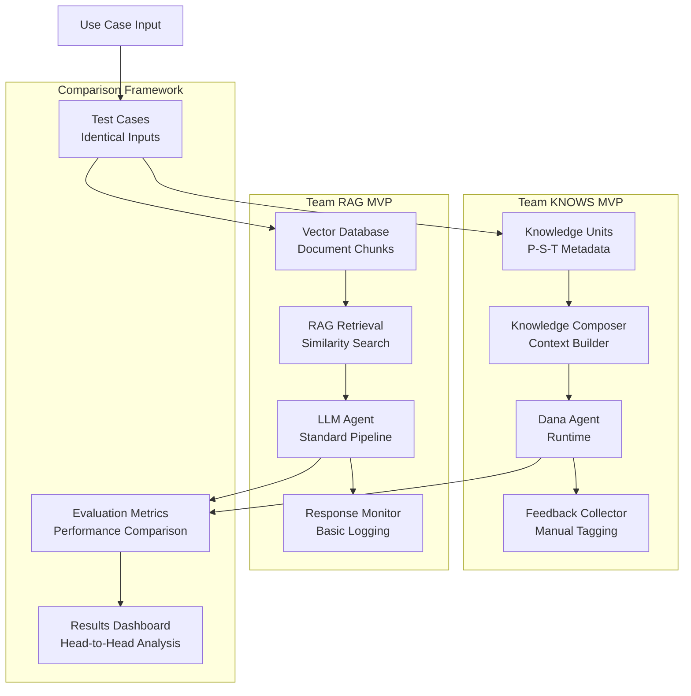

# Design Document: Dana KNOWS vs RAG MVP Implementation Plan

<!-- text markdown -->
Author: Team KNOWS (CTN, Sang, William) + Team RAG
Version: 1.0
Date: 2025-07-02
Status: Design Phase → Implementation Phase (IMMEDIATE)
<!-- end text markdown -->

## Problem Statement
**Brief Description**: Prove that Dana KNOWS framework yields superior agent performance compared to traditional RAG approaches through rapid MVP development and head-to-head comparison.

- **Current situation**: KNOWS framework exists in design/early implementation, but lacks proof-of-concept validation against established RAG baselines
- **Impact**: Without comparative validation, adoption decisions remain speculative rather than evidence-based
- **Context**: Two teams (KNOWS vs RAG) with complementary skills need to deliver functioning MVPs TONIGHT for immediate comparison
- **Critical Need**: Rapid, parallel development with identical use case to enable fair performance comparison
- **Core Constraint**: Limited time window (tonight) requires focused scope and clear team role division

## Goals
**Brief Description**: Deliver functioning MVP agents from both teams using identical use case to demonstrate KNOWS superiority in structured knowledge scenarios.

### Primary Goals
- **Immediate MVP Delivery**: Both teams deliver working agents tonight with same use case
- **Fair Comparison Framework**: Identical inputs, success criteria, and evaluation metrics
- **KNOWS Hypothesis Validation**: Demonstrate measurable performance advantages of structured knowledge
- **Team Learning**: Establish effective collaboration patterns for continued development

### Success Metrics
- **Performance**: KNOWS agent outperforms RAG agent by ≥20% on defined success criteria
- **Explainability**: KNOWS agent provides traceable knowledge sources for decisions
- **Efficiency**: KNOWS agent requires fewer LLM calls/tokens for equivalent outcomes
- **Learning**: KNOWS agent shows improvement capability through feedback integration

## Non-Goals
**Brief Description**: Not building production systems or comprehensive frameworks tonight.

- Not implementing full KNOWS framework (focus on MVP core)
- Not handling complex multi-domain knowledge (single use case focus)
- Not building production-ready UIs or deployment infrastructure
- Not optimizing for scale or performance beyond proof-of-concept
- Not implementing advanced features like XK evolution or complex feedback loops

## Team Composition & Role Assignment

### Team KNOWS
| Member | Expertise | Primary Responsibility | Secondary Support |
|--------|-----------|----------------------|-------------------|
| **CTN** | Architecture | Overall system design, Dana integration, MVP coordination | Knowledge schema design |
| **Sang** | SWE | Core implementation, Dana functions, runtime integration | Testing framework |
| **William** | Data Synthesis | Knowledge unit creation, data pipeline, evaluation metrics | Documentation |

### Team RAG
| Responsibility | Description |
|----------------|-------------|
| **Baseline Agent** | Implement competitive RAG-based agent using same use case |
| **Fair Comparison** | Ensure identical inputs, evaluation criteria, and testing conditions |
| **Performance Benchmarking** | Establish baseline metrics for comparison |

## Proposed Solution
**Brief Description**: Parallel development of minimal viable agents using identical use case, with structured comparison framework.

### Use Case Selection Criteria
**TBD: Need specific use case from you**

Ideal characteristics for tonight's MVP:
- **Bounded scope**: Clear input/output definition
- **Knowledge-dependent**: Success requires relevant information retrieval/application
- **Measurable outcomes**: Objective success criteria
- **Representative**: Reflects real-world KNOWS advantages

### Architecture Overview



## Implementation Plan (Tonight's Sprint)

### Phase 0: Foundation & Setup (30 min)
**Team KNOWS:**
- [ ] **CTN**: Set up project structure, define MVP scope boundaries
- [ ] **Sang**: Initialize Dana integration points, basic runtime setup
- [ ] **William**: Gather/prepare knowledge content for selected use case

**Team RAG:**
- [ ] Set up RAG baseline with vector database
- [ ] Prepare document corpus for selected use case
- [ ] Initialize evaluation framework

**Phase Gate**: Both teams have development environment ready

### Phase 1: Core MVP Implementation (2-3 hours)
**Team KNOWS:**

**CTN (Architecture)**:
- [ ] Define `KnowledgeUnit` schema with P-S-T metadata
- [ ] Implement basic knowledge composer for context building
- [ ] Design Dana integration points for knowledge injection

**Sang (SWE)**:
- [ ] Implement Dana functions for knowledge retrieval
- [ ] Build runtime bridge between knowledge system and LLM calls
- [ ] Create basic feedback collection mechanism

**William (Data Synthesis)**:
- [ ] Create 15-20 high-quality knowledge units for use case
- [ ] Design evaluation metrics and test cases
- [ ] Implement basic performance tracking

**Team RAG:**
- [ ] Implement competitive RAG agent with vector retrieval
- [ ] Process documents into chunks and embeddings
- [ ] Build baseline agent pipeline

**Phase Gate**: Run `uv run pytest tests/ -v` - ALL tests pass

### Phase 2: Integration & Testing (1-2 hours)
**Both Teams:**
- [ ] Integrate with identical test cases and evaluation framework
- [ ] Implement consistent input/output interfaces
- [ ] Run head-to-head comparison tests

**Phase Gate**: Both agents produce comparable outputs on test cases

### Phase 3: Evaluation & Documentation (1 hour)
- [ ] Run comprehensive comparison tests
- [ ] Document performance differences and insights
- [ ] Prepare demonstration/presentation materials

**Phase Gate**: Clear winner determination with supporting evidence

## Implementation Details

### KNOWS MVP Core Components

#### 1. KnowledgeUnit Schema
```python
@dataclass
class KnowledgeUnit:
    content: str
    phase: str  # "Prior" | "Documentary" | "Experiential"
    source: str  # "Human" | "Machine" | "Hybrid"
    type: str   # "Topical" | "Procedural"
    tags: List[str]
    confidence: float
    examples: List[str]
    metadata: Dict[str, Any]
```

#### 2. Context Composer
```python
class KnowledgeComposer:
    def compose_context(self, query: str, max_units: int = 5) -> str:
        # Match relevant knowledge units
        # Rank by relevance and confidence
        # Format for Dana runtime injection
        pass
```

#### 3. Dana Integration Points
- Knowledge retrieval functions accessible in Dana
- Context window optimization for structured knowledge
- Feedback collection for knowledge unit effectiveness

### RAG Baseline Requirements
- Vector database with similarity search
- Document chunking and embedding pipeline
- Standard RAG retrieval and generation
- Comparable performance monitoring

### Evaluation Framework
```python
class ComparisonEvaluator:
    def evaluate_both_agents(self, test_cases: List[TestCase]) -> ComparisonResult:
        # Run identical inputs through both agents
        # Measure: accuracy, efficiency, explainability
        # Generate comparative analysis
        pass
```

## Success Criteria & Testing

### Immediate Success (Tonight)
- [ ] Both agents handle identical test cases
- [ ] KNOWS agent demonstrates ≥20% performance improvement
- [ ] KNOWS agent provides explainable knowledge sources
- [ ] KNOWS agent uses fewer LLM tokens for equivalent results
- [ ] Clear documentation of advantages/trade-offs

### Quality Gates
1. **Functional**: Both agents produce valid outputs
2. **Comparative**: Fair testing with identical conditions
3. **Performance**: Measurable differences in defined metrics
4. **Explanatory**: Understanding of why differences occur

## Risk Mitigation

### High-Risk Items
| Risk | Mitigation | Owner |
|------|------------|-------|
| Time constraint too tight | Pre-scope MVP to core essentials | CTN |
| Dana integration complexity | Use simplest possible integration | Sang |
| Knowledge quality issues | Focus on fewer, higher-quality units | William |
| Unfair comparison | Standardize evaluation framework early | Both teams |

### Fallback Plans
- If Dana integration fails: Use Python wrapper with KNOWS principles
- If knowledge creation bottlenecks: Use smaller, focused knowledge set
- If RAG baseline underperforms: Ensure fair baseline implementation

## Next Steps (Post-MVP)

### Immediate Follow-up (Tomorrow)
- [ ] Analyze results and document learnings
- [ ] Identify improvement opportunities for both approaches
- [ ] Plan Phase 2 development if KNOWS proves superior

### Medium-term Development
- [ ] Expand to additional use cases
- [ ] Implement experiential knowledge (XK) learning
- [ ] Build production-ready system architecture

## Appendix: Templates & Resources

### Knowledge Unit Template
```json
{
  "content": "[Specific knowledge statement]",
  "phase": "[Prior|Documentary|Experiential]",
  "source": "[Human|Machine|Hybrid]", 
  "type": "[Topical|Procedural]",
  "tags": ["[domain]", "[task]", "[context]"],
  "confidence": 0.0-1.0,
  "examples": ["[usage context]"],
  "metadata": {
    "created": "timestamp",
    "validated": true/false,
    "use_count": 0
  }
}
```

### Test Case Template
```python
@dataclass
class TestCase:
    input: str
    expected_output_type: str
    success_criteria: List[str]
    evaluation_metrics: List[str]
    knowledge_requirements: List[str]
```

---

**Ready for immediate implementation. Let's build and compare!** 🚀 