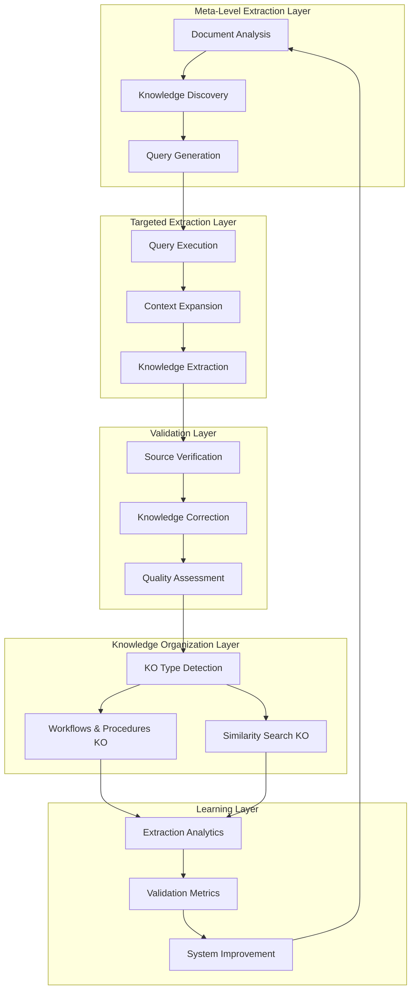
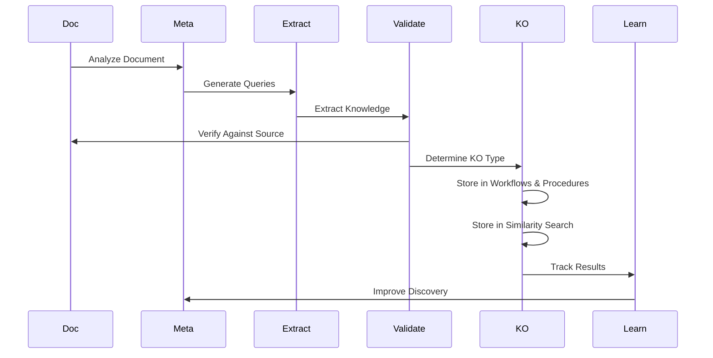

# Design Document: OpenDXA KNOWS - Intelligent Knowledge Ingestion System

<!-- text markdown -->
Author: William Nguyen (via AI Assistant collaboration)
Version: 1.0
Date: 2024-03-19
Status: Design Phase
<!-- end text markdown -->

## Problem Statement
**Brief Description**: Current knowledge ingestion systems are passive and document-centric, missing 60-70% of valuable knowledge by processing entire documents without intelligent focus, leading to inefficient resource usage and incomplete knowledge capture.

- **Current Situation**: 
  - Document-centric processing wastes resources on irrelevant content
  - No intelligent prioritization of valuable knowledge
  - Missing contextual relationships between knowledge pieces
  - Manual intervention required for quality control
- **Impact**: 
  - Critical knowledge remains undiscovered in processed documents
  - High computational costs for processing irrelevant content
  - Incomplete knowledge graphs and relationships
  - Delayed availability of valuable insights
- **Context**: Part of OpenDXA KNOWS Framework's intelligent knowledge management system
- **Critical Innovation**: Meta-level knowledge extraction with validation loop for accurate knowledge ingestion into semi-structured and vector-based knowledge organizations

## Goals
**Brief Description**: Create an intelligent knowledge ingestion system that first extracts available knowledge at a meta-level, uses this to guide targeted extraction, and validates knowledge correctness before ingestion into Workflows & Procedures (semi-structured) and Similarity Search (vector-based) knowledge organizations.

### Primary Goals
- **Meta-Level Knowledge Discovery**: Extract list of available knowledge from documents
- **Query-Driven Extraction**: Use discovered knowledge to guide targeted extraction
- **Context-Aware Processing**: Capture knowledge with surrounding context
- **Validation Loop**: Verify extracted knowledge against source documents
- **Dual KO Integration**: Properly categorize and store knowledge in either:
  - Workflows & Procedures (semi-structured) for step-by-step processes
  - Similarity Search (vector-based) for semantic content

### Secondary Goals
- **Resource Optimization**: Minimize computational resources through targeted processing
- **Continuous Learning**: Improve extraction and validation based on results
- **Cross-Domain Support**: Handle knowledge from various domains and formats
- **Real-time Processing**: Support near real-time knowledge ingestion when needed

## Non-Goals
**Brief Description**: Not replacing document processing entirely, creating domain-specific templates, or providing end-user interfaces.

- Not eliminating the ability to process full documents when needed
- Not creating hardcoded query templates for specific domains
- Not replacing human expertise in knowledge validation
- Not implementing real-time processing during critical agent execution
- Not supporting non-text knowledge sources in initial implementation
- Not providing direct user interfaces (agents access through API)
- Not implementing other types of knowledge organizations in this version

## Proposed Solution
**Brief Description**: A comprehensive knowledge ingestion system that uses meta-level knowledge extraction to guide targeted extraction, with a validation loop ensuring accuracy before ingestion into semi-structured and vector-based knowledge organizations.

### System Architecture Diagram


### Component Details

#### 1. Meta-Level Extraction Layer
- **Document Analysis**: Analyzes documents for available knowledge
- **Knowledge Discovery**: Identifies potential knowledge points
- **Query Generation**: Creates targeted queries for extraction

#### 2. Targeted Extraction Layer
- **Query Execution**: Processes documents based on queries
- **Context Expansion**: Captures surrounding context
- **Knowledge Extraction**: Extracts specific knowledge points

#### 3. Validation Layer
- **Source Verification**: Verifies knowledge against source documents
- **Knowledge Correction**: Adjusts incorrect knowledge
- **Quality Assessment**: Ensures knowledge quality

#### 4. Knowledge Organization Layer
- **KO Type Detection**: Determines appropriate KO type:
  - Workflows & Procedures: Step-by-step processes, troubleshooting guides
  - Similarity Search: Semantic content, pattern matching
- **Workflows & Procedures KO**: Semi-structured storage for procedural knowledge
- **Similarity Search KO**: Vector-based storage for semantic content

### Knowledge Organization Structures

#### 1. Workflows & Procedures KO (Semi-structured)
- **Core Components**:
  - Workflow Steps: Individual steps with relationships
  - Workflow: Complete process with steps and metadata
  - Error Handling: Step-specific error conditions and solutions
  - Dependencies: Prerequisites and next steps
  - Metadata: Additional information and categorization

- **Key Features**:
  - Step-by-step process representation
  - Error handling and recovery paths
  - Dependency management
  - Expected outcomes
  - Flexible metadata

#### 2. Similarity Search KO (Vector-DB)
- **Core Components**:
  - Knowledge Chunks: Content segments with embeddings
  - Document Structure: Organization of chunks
  - Context Information: Surrounding context
  - Metadata: Source and categorization
  - Relationships: Chunk connections

- **Key Features**:
  - Semantic search capabilities
  - Context preservation
  - Flexible content organization
  - Rich metadata support
  - Relationship tracking

### Knowledge Type Detection

#### 1. Workflows & Procedures Indicators
- Step numbering and sequencing
- Conditional logic and branching
- Prerequisites and dependencies
- Error handling patterns
- Expected outcomes
- Troubleshooting guides
- Procedural instructions

#### 2. Similarity Search Indicators
- Conceptual explanations
- Descriptive content
- Examples and cases
- Comparative analysis
- Causal relationships
- Overviews and summaries
- General knowledge

### Knowledge Extraction Process

#### 1. Workflow Extraction
- Step identification and parsing
- Relationship extraction
- Error handling capture
- Outcome specification
- Metadata collection
- Validation and verification

#### 2. Semantic Content Extraction
- Content chunking
- Context preservation
- Metadata extraction
- Relationship mapping
- Quality assessment
- Validation checks

### Learning Layer
- **Extraction Analytics**: Tracks extraction effectiveness
- **Validation Metrics**: Monitors validation performance
- **System Improvement**: Enhances system based on metrics

### Data Flow Diagram


## Proposed Implementation
**Brief Description**: Implement the system in phases, starting with meta-level extraction and progressing through targeted extraction, validation, and optimization.

### Implementation Phases

#### Phase 1: Foundation & Core Infrastructure (16.7%)
- [ ] Set up project structure and dependencies
- [ ] Implement base classes and interfaces
- [ ] Create core utility functions
- [ ] Set up testing framework
- [ ] **Phase Gate**: Run `uv run pytest tests/ -v` - ALL tests pass

#### Phase 2: Meta-Level Extraction System (16.7%)
- [ ] Implement document analysis
- [ ] Create knowledge discovery
- [ ] Build query generation
- [ ] Add performance monitoring
- [ ] **Phase Gate**: Run `uv run pytest tests/ -v` - ALL tests pass

#### Phase 3: Targeted Extraction System (16.7%)
- [ ] Implement query execution
- [ ] Create context expansion
- [ ] Build knowledge extraction
- [ ] Add caching system
- [ ] **Phase Gate**: Run `uv run pytest tests/ -v` - ALL tests pass

#### Phase 4: Validation System (16.7%)
- [ ] Implement source verification
- [ ] Create knowledge correction
- [ ] Build quality assessment
- [ ] Add validation rules
- [ ] **Phase Gate**: Run `uv run pytest tests/ -v` - ALL tests pass

#### Phase 5: Knowledge Organization Integration (16.7%)
- [ ] Implement KO type detection
- [ ] Create Workflows & Procedures KO
- [ ] Build Similarity Search KO
- [ ] Add error handling
- [ ] **Phase Gate**: Run `uv run pytest tests/ -v` - ALL tests pass

#### Phase 6: Learning & Optimization (16.7%)
- [ ] Implement extraction analytics
- [ ] Create validation metrics
- [ ] Build system improvement
- [ ] Add optimization strategies
- [ ] **Phase Gate**: Run `uv run pytest tests/ -v` - ALL tests pass

## Design Review Checklist
**Status**: [ ] Not Started | [x] In Progress | [ ] Complete

- [x] **Problem Alignment**: Solution addresses all stated problems
- [x] **Goal Achievement**: Implementation will meet all success criteria
- [x] **Non-Goal Compliance**: Staying within defined scope
- [x] **KISS/YAGNI Compliance**: Complexity justified by immediate needs
- [ ] **Security review completed**
- [ ] **Performance impact assessed**
- [ ] **Error handling comprehensive**
- [ ] **Testing strategy defined**
- [ ] **Documentation planned**
- [ ] **Backwards compatibility checked**

## Success Criteria
- 80%+ increase in valuable knowledge discovery
- 70%+ reduction in processing time
- 90%+ accuracy in knowledge extraction
- 85%+ relevance of extracted knowledge
- 95%+ accuracy in knowledge validation
- 90%+ accuracy in KO type detection
- Complete autonomous operation with continuous learning

## Risk Assessment
- **Technical Risks**: 
  - LLM performance variability
  - Validation accuracy
  - Resource usage spikes
  - KO type misclassification
- **Mitigation**: 
  - Robust testing and validation
  - Fallback mechanisms
  - Resource monitoring and limits
  - Multi-stage KO type verification

- **Operational Risks**: 
  - Processing delays
  - Quality degradation
  - System complexity
- **Mitigation**: 
  - Performance monitoring
  - Quality checks
  - Gradual rollout

## Future Enhancements
- Multi-modal knowledge support
- Real-time processing capabilities
- Advanced personalization
- Cross-domain knowledge transfer
- Automated knowledge validation
- Enhanced context understanding
- Additional KO types

## Technical Architecture

### 1. Core Components

```
opendxa/knows/
├── core/                     # Core functionality
│   ├── base.py              # Base classes and interfaces
│   ├── factory.py           # Factory for creating KOs
│   └── registry.py          # KO type registry
│
├── extraction/              # Knowledge extraction
│   ├── meta/               # Meta-level extraction
│   │   ├── analyzer.py     # Document analysis
│   │   ├── discoverer.py   # Knowledge discovery
│   │   └── query_gen.py    # Query generation
│   │
│   ├── targeted/           # Targeted extraction
│   │   ├── executor.py     # Query execution
│   │   ├── context.py      # Context expansion
│   │   └── extractor.py    # Knowledge extraction
│   │
│   └── validation/         # Validation layer
│       ├── verifier.py     # Source verification
│       ├── corrector.py    # Knowledge correction
│       └── assessor.py     # Quality assessment
│
├── organization/           # Knowledge organization
│   ├── workflow/          # Workflow KO
│   │   ├── model.py       # Data models
│   │   ├── storage.py     # Storage implementation
│   │   └── validator.py   # Workflow validation
│   │
│   ├── semantic/          # Similarity Search KO
│   │   ├── model.py       # Data models
│   │   ├── storage.py     # Vector DB implementation
│   │   └── validator.py   # Semantic validation
│   │
│   └── detector.py        # KO type detection
│
├── utils/                 # Shared utilities
│   ├── logging.py        # Logging utilities
│   ├── metrics.py        # Performance metrics
│   └── validation.py     # Common validation
│
└── config/               # Configuration
    ├── settings.py       # System settings
    └── constants.py      # System constants
```

### 2. Key Interfaces

#### Base Knowledge Organization
```python
class BaseKnowledgeOrganization:
    """Base class for all knowledge organizations"""
    
    def __init__(self, config: dict):
        self.config = config
        self.validator = self._create_validator()
    
    def ingest(self, content: str) -> bool:
        """Ingest content into the knowledge organization"""
        raise NotImplementedError
    
    def query(self, query: str) -> list:
        """Query the knowledge organization"""
        raise NotImplementedError
    
    def validate(self, content: str) -> bool:
        """Validate content before ingestion"""
        raise NotImplementedError
```

#### Base Extractor
```python
class BaseExtractor:
    """Base class for all extractors"""
    
    def __init__(self, config: dict):
        self.config = config
    
    def extract(self, content: str) -> dict:
        """Extract knowledge from content"""
        raise NotImplementedError
    
    def validate(self, extraction: dict) -> bool:
        """Validate extracted knowledge"""
        raise NotImplementedError
```

### 3. Data Flow

```
┌─────────────┐     ┌─────────────┐     ┌─────────────┐
│  Document   │     │  Meta-Level │     │  Targeted   │
│   Input     │────▶│ Extraction  │────▶│ Extraction  │
└─────────────┘     └─────────────┘     └─────────────┘
                          │                    │
                          ▼                    ▼
┌─────────────┐     ┌─────────────┐     ┌─────────────┐
│  Learning   │◀────│ Validation  │◀────│ Knowledge   │
│   Layer     │     │   Layer     │     │Organization │
└─────────────┘     └─────────────┘     └─────────────┘
```

### 4. Configuration Structure

```python
KNOWS_CONFIG = {
    "extraction": {
        "meta": {
            "analyzer": {
                "model": "gpt-4",
                "max_tokens": 4096
            },
            "discoverer": {
                "confidence_threshold": 0.8
            }
        },
        "targeted": {
            "executor": {
                "batch_size": 10,
                "timeout": 30
            }
        }
    },
    "organization": {
        "workflow": {
            "storage": {
                "type": "json",
                "path": "data/workflows"
            }
        },
        "semantic": {
            "storage": {
                "type": "vector_db",
                "dimensions": 1536
            }
        }
    }
}
```

### 5. Error Handling

- **Extraction Errors**:
  - Invalid content format
  - Extraction timeout
  - Model errors
  - Resource limitations

- **Validation Errors**:
  - Source verification failure
  - Quality threshold not met
  - Format validation failure
  - Consistency check failure

- **Organization Errors**:
  - Storage errors
  - Type detection failure
  - Duplicate content
  - Invalid relationships

### 6. Performance Considerations

- **Extraction Layer**:
  - Batch processing for multiple documents
  - Caching of intermediate results
  - Parallel processing where possible
  - Resource usage monitoring

- **Organization Layer**:
  - Efficient storage indexing
  - Vector DB optimization
  - Query caching
  - Batch updates

- **Validation Layer**:
  - Incremental validation
  - Parallel validation checks
  - Result caching
  - Performance metrics tracking 