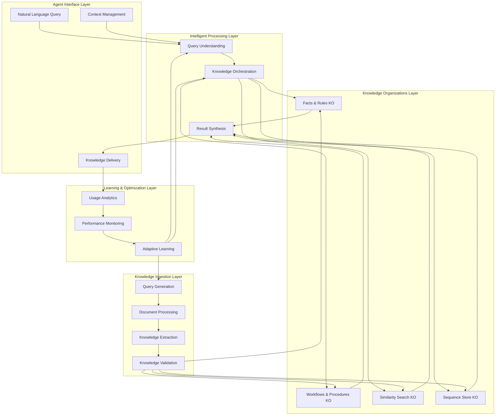
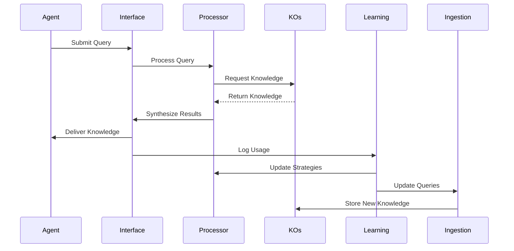

# Design Document: OpenDXA KNOWS Framework

<!-- text markdown -->
Author: William Nguyen (via AI Assistant collaboration)
Version: 1.0
Date: 2024-03-19
Status: Design Phase
<!-- end text markdown -->

## Problem Statement
**Brief Description**: Domain-expert agents need an intelligent knowledge management system that can both autonomously discover and capture valuable knowledge, and deliver the right knowledge at the right time during task execution.

- **Current Situation**: 
  - Knowledge ingestion is document-centric and passive, missing 60-70% of valuable knowledge
  - Knowledge retrieval requires agents to know what to ask and where to look
  - No intelligent orchestration between what knowledge exists and what agents need
  - Manual processes create bottlenecks and limit knowledge discovery and access
- **Impact**: 
  - Agents struggle with knowledge gaps that could be filled from available sources
  - Critical knowledge remains undiscovered in existing documents
  - Agents waste time searching for knowledge instead of solving problems
  - Inconsistent knowledge access leads to suboptimal decision-making
- **Context**: OpenDXA KNOWS Framework needs a complete intelligent knowledge management system
- **Critical Innovation**: Unified system with autonomous knowledge ingestion and context-aware knowledge retrieval that learns and adapts to agent needs

## Goals
**Brief Description**: Create a complete intelligent knowledge management system that autonomously discovers, captures, organizes, and delivers knowledge to domain-expert agents based on their context and needs.

### Knowledge Ingestion Goals
- **Autonomous Knowledge Discovery**: Generate queries automatically based on system analysis
- **Query-Driven Efficiency**: Focus processing only on relevant information found through vector search
- **Context-Aware Extraction**: Expand context around relevant matches to ensure completeness
- **Continuous Learning**: Improve ingestion based on knowledge usage patterns

### Knowledge Retrieval Goals
- **Context-Aware Delivery**: Provide relevant knowledge based on agent's current task and context
- **Intelligent Query Understanding**: Interpret natural language queries and route to appropriate KOs
- **Proactive Knowledge Suggestions**: Anticipate knowledge needs before agents ask
- **Adaptive Personalization**: Learn individual agent preferences and optimize delivery

### Unified System Goals
- **Seamless Integration**: Ingestion and retrieval work together to optimize knowledge value
- **Zero Human Intervention**: Operate completely autonomously while maintaining high quality
- **Cross-Domain Intelligence**: Discover and deliver knowledge across different domains
- **Performance Optimization**: Continuously improve both ingestion and retrieval effectiveness

## Non-Goals
**Brief Description**: Not replacing existing document processing, creating domain-specific templates, or providing end-user interfaces.

- Not eliminating the ability to process full documents when needed
- Not creating hardcoded query templates for specific domains
- Not replacing human expertise in knowledge validation
- Not implementing real-time processing during critical agent execution
- Not supporting non-text knowledge sources in initial implementation
- Not providing direct user interfaces (agents access through API)

## Proposed Solution
**Brief Description**: A unified intelligent knowledge management system with autonomous ingestion and context-aware retrieval, powered by LLMs and continuous learning.

### System Architecture Diagram

### Component Details

#### 1. Agent Interface Layer
- **Natural Language Query**: Handles agent queries in natural language
- **Context Management**: Maintains agent state and context
- **Knowledge Delivery**: Formats and delivers knowledge to agents

#### 2. Intelligent Processing Layer
- **Query Understanding**: Interprets queries and determines knowledge needs
- **Knowledge Orchestration**: Routes queries to appropriate KOs
- **Result Synthesis**: Combines knowledge from multiple sources

#### 3. Knowledge Organizations Layer
- **Facts & Rules KO**: Stores declarative knowledge
- **Workflows & Procedures KO**: Stores procedural knowledge
- **Similarity Search KO**: Handles semantic search
- **Sequence Store KO**: Manages temporal knowledge

#### 4. Learning & Optimization Layer
- **Usage Analytics**: Tracks knowledge usage patterns
- **Performance Monitoring**: Evaluates system effectiveness
- **Adaptive Learning**: Improves system based on analytics

#### 5. Knowledge Ingestion Layer
- **Query Generation**: Creates intelligent queries based on system analysis
- **Document Processing**: Efficiently processes relevant document sections
- **Knowledge Extraction**: Extracts valuable knowledge with context
- **Knowledge Validation**: Ensures quality and relevance of extracted knowledge

### Data Flow Diagram

## Proposed Implementation
**Brief Description**: Implement the system in phases, starting with core infrastructure and progressing through intelligent retrieval, ingestion, and optimization.

### Implementation Phases

#### Phase 1: Foundation & Core Infrastructure (16.7%)
- [ ] Set up project structure and dependencies
- [ ] Implement base classes and interfaces
- [ ] Create core utility functions
- [ ] Set up testing framework
- [ ] **Phase Gate**: Run `uv run pytest tests/ -v` - ALL tests pass

#### Phase 2: Intelligent Retrieval System (16.7%)
- [ ] Implement query understanding
- [ ] Create knowledge orchestration
- [ ] Build result synthesis
- [ ] Add context management
- [ ] **Phase Gate**: Run `uv run pytest tests/ -v` - ALL tests pass

#### Phase 3: Intelligent Ingestion System (16.7%)
- [ ] Implement autonomous query generation
- [ ] Create query-driven processing
- [ ] Build context-aware extraction
- [ ] Add knowledge validation
- [ ] **Phase Gate**: Run `uv run pytest tests/ -v` - ALL tests pass

#### Phase 4: Learning & Optimization (16.7%)
- [ ] Implement usage analytics
- [ ] Create performance monitoring
- [ ] Build adaptive learning
- [ ] Add optimization strategies
- [ ] **Phase Gate**: Run `uv run pytest tests/ -v` - ALL tests pass

#### Phase 5: Integration & Orchestration (16.7%)
- [ ] Integrate all components
- [ ] Implement system orchestration
- [ ] Add error handling
- [ ] Create monitoring dashboard
- [ ] **Phase Gate**: Run `uv run pytest tests/ -v` - ALL tests pass

#### Phase 6: Polish & Production Readiness (16.7%)
- [ ] Optimize performance
- [ ] Add comprehensive logging
- [ ] Create documentation
- [ ] Perform security audit
- [ ] **Phase Gate**: Run `uv run pytest tests/ -v` - ALL tests pass

## Design Review Checklist
**Status**: [ ] Not Started | [x] In Progress | [ ] Complete

- [x] **Problem Alignment**: Solution addresses all stated problems
- [x] **Goal Achievement**: Implementation will meet all success criteria
- [x] **Non-Goal Compliance**: Staying within defined scope
- [x] **KISS/YAGNI Compliance**: Complexity justified by immediate needs
- [ ] **Security review completed**
- [ ] **Performance impact assessed**
- [ ] **Error handling comprehensive**
- [ ] **Testing strategy defined**
- [ ] **Documentation planned**
- [ ] **Backwards compatibility checked**

## Success Criteria
- 80%+ increase in valuable knowledge discovery
- 90%+ accuracy in knowledge retrieval relevance
- 60%+ reduction in agent time spent searching
- 70%+ improvement in agent decision-making
- Complete autonomous operation with continuous learning

## Risk Assessment
- **Technical Risks**: LLM performance, system complexity
- **Mitigation**: Robust testing, gradual rollout
- **Operational Risks**: Resource usage, maintenance
- **Mitigation**: Monitoring, optimization

## Future Enhancements
- Multi-modal knowledge support
- Real-time processing capabilities
- Advanced personalization
- Cross-domain knowledge transfer
