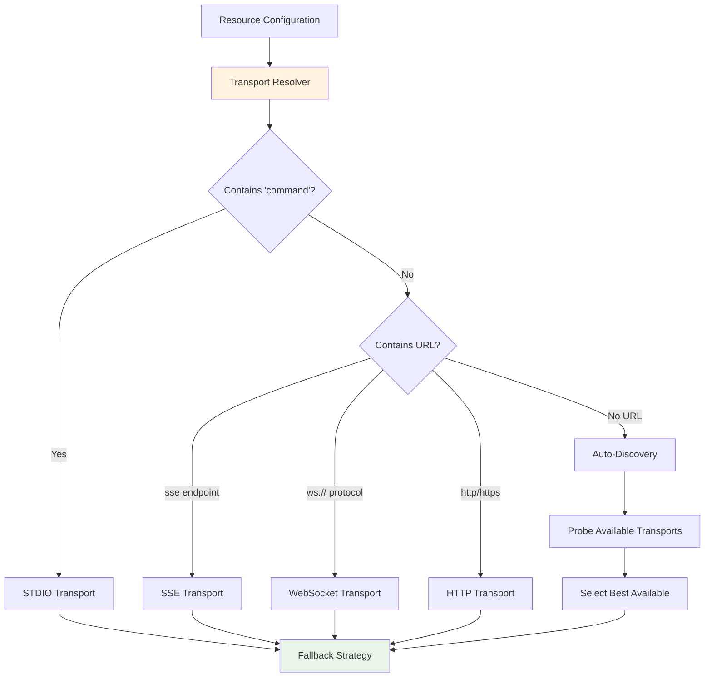
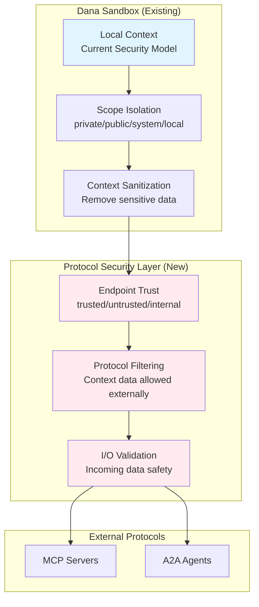
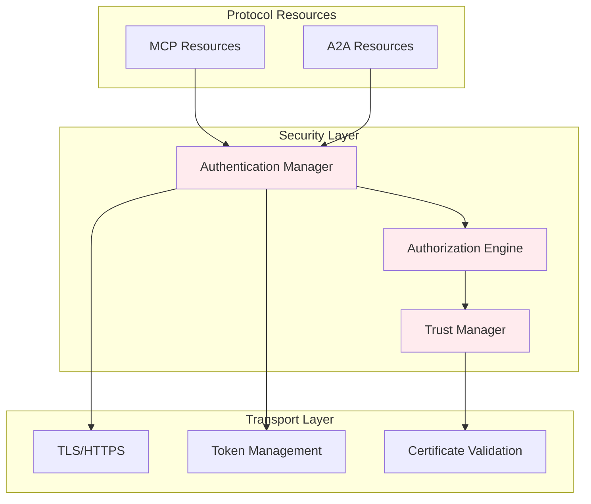

# Discussing security considerations for Dana SandboxContext
_Exported on 6/2/2025 at 16:49:05 GMT+9 from Cursor (0.50.7)_

---

**User**

Review the below. I want to think about security considerations in the Dana SandboxContext. Discuss only. Critique and advise.


# **Comprehensive Context Prompt for OpenDXA MCP/A2A Resources Integration**

## **Project Overview**
We are designing and implementing **MCP (Model Context Protocol) and A2A (Agent-to-Agent) protocol support** for OpenDXA, an agentic AI programming framework that uses the **Dana domain-specific language**. This integration will enable **bidirectional communication** - both consuming external services and providing OpenDXA capabilities to external clients.

## **Key Architecture Decisions Made**

### **1. Resource-Centric Approach**
- **Core Principle**: Both MCP tools and A2A agents are treated as specialized types of OpenDXA resources
- **Extends existing patterns**: Leverages OpenDXA's established resource architecture
- **Unified interface**: Same `use()` syntax for both protocols in Dana language

### **2. Bidirectional Protocol Support**
**Client Side (Consuming External Services):**
- Use external MCP servers (filesystem, database tools, etc.)
- Collaborate with external A2A agents (research specialists, planners, etc.)

**Server Side (Providing Services):**
- Expose OpenDXA agents as MCP servers for external MCP clients
- Expose OpenDXA agents as A2A agents for external agent frameworks

### **3. Context Management with `with` Statements**
- **BaseResource inherits from `contextlib.AbstractContextManager`**
- **Template method pattern**: `_initialize_resource()`, `_cleanup_resource()`, `_emergency_cleanup()`
- **Guaranteed cleanup**: Connections, sessions, and handles properly closed
- **Error resilience**: Resources cleaned up even when exceptions occur

### **4. Dana Language Integration**
**Two usage patterns:**
```dana
# Simple usage - automatic cleanup when scope ends
files = use("mcp.filesystem")
data = files.list_directory("/data")

# Context-managed usage - explicit lifecycle control
with database = use("mcp.database", "https://db.company.com/mcp"):
    results = database.query("SELECT * FROM sales")
# database connection automatically closed here
```

### **5. Library-Based Implementation Strategy**
**MCP Server**: Use **Anthropic's official MCP SDK** for protocol compliance
**A2A Server**: Use **Google's official A2A SDK** for ecosystem compatibility
**Benefits**: Protocol correctness, future-proofing, less custom code, client compatibility

## **Module Structure Designed**
```
opendxa/
  common/
    resource/
      mcp/
        client/                     # Consuming external MCP servers
          mcp_resource.py          # External MCP tools as resources
          discovery.py             # MCP server discovery
          transport/ (stdio, sse, http)
        server/                     # Providing MCP services  
          mcp_server_adapter.py    # Anthropic MCP SDK integration
          tool_exporter.py         # Export Dana functions as MCP tools
      a2a/
        client/                     # Collaborating with external A2A agents
          a2a_resource.py          # External agents as resources
          discovery.py             # A2A agent discovery
        server/                     # Providing A2A services
          a2a_server_adapter.py    # Google A2A SDK integration
          agent_card_generator.py  # Generate agent cards
      protocol_base.py             # BaseResource with AbstractContextManager
```

## **Transport Strategy**
- **Smart auto-detection**: URL/config-based transport selection
- **Fallback resilience**: Multiple transport options (SSE → HTTP → WebSocket → STDIO)
- **Protocol-specific priorities**: SSE preferred for streaming, HTTP for simple request/response

## **Design Principles Applied**
- **KISS/YAGNI**: Simple, practical design avoiding premature abstraction
- **Resource-centric**: Leverages OpenDXA's existing resource patterns
- **Standard libraries**: Use `contextlib.AbstractContextManager`, Anthropic MCP SDK, Google A2A SDK
- **NLIP-compatible**: Designed for future protocol federation compatibility

## **Implementation Phases**
**Phase 1 (v0.5)**: Core infrastructure - BaseResource context management, enhanced MCP client, A2A client foundation
**Phase 2 (v0.6)**: Server-side capabilities using Anthropic and Google SDKs  
**Phase 3 (v0.7)**: Advanced features - enhanced discovery, enterprise features

## **Current Status**
- ✅ **Design document completed**: `docs/designs/mcp-a2a-resources.md`
- ✅ **Architecture finalized**: Resource hierarchy, context management, library choices
- ✅ **Module structure defined**: Clear separation of client/server for both protocols
- ⏳ **Ready for implementation**: Next step is to begin coding the core infrastructure

## **Key Questions for Implementation**
1. **BaseResource implementation**: How to integrate context manager with existing OpenDXA resource patterns?
2. **Dana interpreter integration**: How to implement `use()` function and `with` statement support?
3. **Transport abstraction**: How to implement the transport resolver with smart defaults?
4. **SDK integration**: How to properly integrate Anthropic's MCP SDK and Google's A2A SDK?
5. **Error handling**: How to handle network failures, authentication errors, and partial connections?
6. **Configuration management**: How to implement progressive configuration complexity (zero-config → advanced)?

## **Next Steps**
The design is complete and ready for implementation. The next conversation should focus on:
1. **Implementation planning**: Breaking down Phase 1 into specific tasks
2. **Code architecture**: Detailed class designs and interfaces
3. **Testing strategy**: How to test protocol integrations and context management
4. **Configuration design**: Detailed configuration file formats and discovery mechanisms


---

**Cursor**

I'll analyze the security considerations for the Dana SandboxContext in the context of this MCP/A2A integration. Let me first examine the current Dana implementation to understand the existing security model.

Now let me examine the runtime scopes to understand the security model better:

Now let me look at some existing resource implementations to understand current security patterns:

Now I have a comprehensive understanding of the Dana SandboxContext and the proposed MCP/A2A integration. Let me provide a detailed security analysis and recommendations.

# **Security Analysis: Dana SandboxContext in MCP/A2A Integration**

## **Current Security Foundation: Strong but Incomplete for Protocol Integration**

### **✅ Excellent Existing Security Architecture**

Dana's current sandbox security model is **sophisticated and well-designed**:

1. **Multi-layered Security Model**: 
   - Sandbox execution environment with resource limits
   - Function access control with 25+ blocked dangerous functions
   - 4-scope variable isolation (`local`, `private`, `public`, `system`)
   - Context isolation between executions
   - Automatic sanitization of sensitive data

2. **Robust Context Sanitization**:
   ```432:531:opendxa/dana/sandbox/sandbox_context.py
   def sanitize(self) -> "SandboxContext":
       # Removes private/system scopes entirely
       # Masks API keys, tokens, credentials automatically
       # Pattern-based detection of sensitive data
   ```

3. **Function-Level Security**:
   ```91:106:opendxa/dana/sandbox/interpreter/functions/sandbox_function.py
   # Automatic context sanitization for all function calls
   sanitized_context = actual_context.copy().sanitize()
   ```

## **⚠️ Critical Security Gaps for MCP/A2A Integration**

### **1. Network Boundary Security (CRITICAL)**

**Problem**: Dana's sandbox was designed for local execution but MCP/A2A introduces **network boundaries** and **external service trust**.

**Risk**: The current `sanitize()` method may not be sufficient for network protocols:

```python
# Current sanitization - good for local execution
def sanitize(self) -> "SandboxContext":
    # Removes private/system scopes
    # But what about data that's safe locally but dangerous over network?
```

**Attack Vectors**:
- **Data Exfiltration**: External MCP servers could receive context data they shouldn't
- **Injection Attacks**: Malicious MCP servers could inject harmful responses
- **Context Pollution**: Untrusted external agents could contaminate local context

### **2. Context Leakage Through Protocol Channels (HIGH)**

**Problem**: MCP/A2A protocols have **bidirectional communication** - they can both consume and provide data.

**Current Gap**:
```85:96:opendxa/dana/sandbox/interpreter/functions/sandbox_function.py
# Sanitizes SandboxContext but not protocol-specific data flows
sanitized_args.append(sanitized_context)
```

**Specific Risks**:
- **Tool Arguments**: MCP tool calls may inadvertently include sensitive context data
- **Agent Collaboration**: A2A agents could receive more context than intended
- **Response Context**: External responses could inject data into sensitive scopes

### **3. Resource Context Manager Security (MEDIUM)**

**Problem**: The proposed `with` statement pattern for resources doesn't have protocol-specific security:

```python
# Proposed pattern - lacks protocol security
with database = use("mcp.database", "https://external.com/mcp"):
    # What prevents context leakage to external.com?
    results = database.query("SELECT * FROM sensitive_data")
```

**Current BaseResource**:
```117:125:opendxa/common/resource/base_resource.py
async def __aenter__(self) -> "BaseResource":
    await self.initialize()
    return self

async def __aexit__(self, exc_type, exc_val, exc_tb) -> None:
    await self.cleanup()
```

**Gap**: No protocol-specific context isolation or sanitization.

### **4. Cross-Protocol Context Sharing (HIGH)**

**Problem**: Dana's scope sharing model may be too permissive for external protocols:

```60:66:opendxa/dana/sandbox/sandbox_context.py
# Global scopes are shared across contexts
if parent:
    for scope in RuntimeScopes.GLOBAL:
        self._state[scope] = parent._state[scope]  # Shared reference
```

**Risk**: External MCP/A2A resources could access shared global state.

## **🛡️ Security Recommendations**

### **1. Protocol-Aware Context Sanitization (CRITICAL)**

**Implement tiered sanitization based on trust boundaries**:

```python
class ProtocolSandboxContext(SandboxContext):
    def sanitize_for_protocol(self, protocol_type: str, endpoint: str) -> "ProtocolSandboxContext":
        """Enhanced sanitization for network protocols."""
        sanitized = self.copy().sanitize()  # Start with existing sanitization
        
        # Protocol-specific sanitization
        if protocol_type == "mcp":
            # MCP tools should only receive minimal context
            sanitized = self._sanitize_for_mcp(sanitized, endpoint)
        elif protocol_type == "a2a":
            # A2A agents may need more context but with explicit controls
            sanitized = self._sanitize_for_a2a(sanitized, endpoint)
            
        return sanitized
    
    def _sanitize_for_mcp(self, context: SandboxContext, endpoint: str) -> SandboxContext:
        """MCP-specific sanitization - minimal context."""
        # Remove all scopes except explicitly allowed public data
        allowed_keys = self._get_mcp_allowed_keys(endpoint)
        return self._filter_context(context, allowed_keys)
    
    def _sanitize_for_a2a(self, context: SandboxContext, endpoint: str) -> SandboxContext:
        """A2A-specific sanitization - controlled context sharing."""
        # Based on agent capabilities and trust level
        trust_level = self._get_agent_trust_level(endpoint)
        return self._apply_trust_based_filtering(context, trust_level)
```

### **2. Protocol Resource Security Wrapper (HIGH)**

**Create security-aware resource base class**:

```python
class ProtocolResource(BaseResource):
    """Security-enhanced base class for protocol resources."""
    
    def __init__(self, name: str, endpoint: str, trust_level: str = "untrusted"):
        super().__init__(name)
        self.endpoint = endpoint
        self.trust_level = trust_level
        self._security_policy = self._load_security_policy()
    
    async def __aenter__(self) -> "ProtocolResource":
        # Create isolated context for this protocol session
        self._original_context = self._get_current_context()
        self._protocol_context = self._create_isolated_context()
        await self.initialize()
        return self
    
    async def __aexit__(self, exc_type, exc_val, exc_tb) -> None:
        # Sanitize any context changes before merging back
        self._sanitize_context_changes()
        await self.cleanup()
        self._restore_original_context()
    
    def _create_isolated_context(self) -> SandboxContext:
        """Create isolated context for protocol operations."""
        base_context = self._original_context
        isolated = base_context.copy()
        
        # Apply protocol-specific isolation
        return isolated.sanitize_for_protocol(self.protocol_type, self.endpoint)
    
    def _sanitize_context_changes(self) -> None:
        """Ensure context changes are safe to merge back."""
        # Validate no sensitive data was added by external protocol
        # Apply output sanitization rules
        pass
```

### **3. Endpoint Trust Management (MEDIUM)**

**Implement endpoint-based security policies**:

```python
class EndpointTrustManager:
    """Manages trust levels and security policies for external endpoints."""
    
    TRUST_LEVELS = {
        "trusted": {
            "allowed_scopes": ["public"],
            "max_context_size": 10000,
            "can_write_public": True,
            "audit_level": "basic"
        },
        "untrusted": {
            "allowed_scopes": [],  # No context access
            "max_context_size": 0,
            "can_write_public": False,
            "audit_level": "full"
        },
        "internal": {
            "allowed_scopes": ["public", "local"],
            "max_context_size": 50000,
            "can_write_public": True,
            "audit_level": "minimal"
        }
    }
    
    def get_trust_level(self, endpoint: str) -> str:
        """Determine trust level for endpoint."""
        # Check allowlist, domain patterns, certificates, etc.
        if self._is_internal_endpoint(endpoint):
            return "internal"
        elif self._is_trusted_endpoint(endpoint):
            return "trusted"
        else:
            return "untrusted"
```

### **4. Input/Output Validation (HIGH)**

**Add protocol-specific I/O validation**:

```python
class ProtocolValidator:
    """Validates data flowing to/from external protocols."""
    
    def validate_outgoing_context(self, context: SandboxContext, endpoint: str) -> bool:
        """Validate context before sending to external endpoint."""
        # Check for sensitive data patterns
        # Validate against endpoint security policy
        # Ensure data size limits
        pass
    
    def validate_incoming_data(self, data: Any, endpoint: str) -> Any:
        """Validate and sanitize data from external endpoint."""
        # Scan for injection patterns
        # Validate data types and structure
        # Apply size limits
        # Remove potentially harmful content
        pass
```

### **5. Audit and Monitoring Enhancement (MEDIUM)**

**Extend existing logging for protocol security**:

```python
# In SandboxContext
def set(self, key: str, value: Any, audit_source: str = "local") -> None:
    """Enhanced set with audit trail."""
    scope, var_name = self._validate_key(key)
    
    # Security audit for external modifications
    if audit_source.startswith(("mcp:", "a2a:")):
        self._audit_external_modification(key, value, audit_source)
    
    # Existing set logic...
    
def _audit_external_modification(self, key: str, value: Any, source: str) -> None:
    """Audit external context modifications."""
    self.add_execution_history({
        "type": "external_context_modification",
        "key": key,
        "source": source,
        "value_hash": hashlib.sha256(str(value).encode()).hexdigest()[:16],
        "security_level": "high"
    })
```

## **🔒 Implementation Priority**

### **Phase 1 (Critical - Before MCP/A2A Launch)**
1. **Protocol-aware context sanitization** - Prevents data leakage
2. **Endpoint trust management** - Foundation for all security decisions
3. **Protocol resource security wrapper** - Isolates external operations

### **Phase 2 (High Priority)**
1. **Input/output validation** - Prevents injection attacks
2. **Enhanced audit logging** - Security monitoring and compliance
3. **Context isolation verification** - Automated security testing

### **Phase 3 (Medium Priority)**
1. **Dynamic security policies** - Runtime security adjustment
2. **Security dashboard** - Visual security monitoring
3. **Automated threat detection** - ML-based anomaly detection

## **🎯 Key Takeaways**

**Strengths to Preserve**:
- Dana's existing sandbox security is excellent for local execution
- The scope-based isolation model is innovative and should be extended
- Current sanitization patterns provide a strong foundation

**Critical Security Additions Needed**:
- **Network trust boundaries** - External endpoints need different security than local functions
- **Protocol-specific sanitization** - MCP and A2A have different security requirements
- **Context isolation for external operations** - Prevent context pollution and data leakage

**Architecture Recommendation**:
Extend the existing `SandboxContext` with protocol-aware security rather than replacing it. The current foundation is strong but needs **network-aware enhancements** for MCP/A2A integration.

The security model should be **layered**: Local execution uses current security, protocol operations add additional protocol-specific security layers.

```python
   def sanitize(self) -> "SandboxContext":
       # Removes private/system scopes entirely
       # Masks API keys, tokens, credentials automatically
       # Pattern-based detection of sensitive data
```

```python
   # Automatic context sanitization for all function calls
   sanitized_context = actual_context.copy().sanitize()
```

```python
# Current sanitization - good for local execution
def sanitize(self) -> "SandboxContext":
    # Removes private/system scopes
    # But what about data that's safe locally but dangerous over network?
```

```python
# Sanitizes SandboxContext but not protocol-specific data flows
sanitized_args.append(sanitized_context)
```

```python
# Proposed pattern - lacks protocol security
with database = use("mcp.database", "https://external.com/mcp"):
    # What prevents context leakage to external.com?
    results = database.query("SELECT * FROM sensitive_data")
```

```python
async def __aenter__(self) -> "BaseResource":
    await self.initialize()
    return self

async def __aexit__(self, exc_type, exc_val, exc_tb) -> None:
    await self.cleanup()
```

```python
# Global scopes are shared across contexts
if parent:
    for scope in RuntimeScopes.GLOBAL:
        self._state[scope] = parent._state[scope]  # Shared reference
```

```python
class ProtocolSandboxContext(SandboxContext):
    def sanitize_for_protocol(self, protocol_type: str, endpoint: str) -> "ProtocolSandboxContext":
        """Enhanced sanitization for network protocols."""
        sanitized = self.copy().sanitize()  # Start with existing sanitization
        
        # Protocol-specific sanitization
        if protocol_type == "mcp":
            # MCP tools should only receive minimal context
            sanitized = self._sanitize_for_mcp(sanitized, endpoint)
        elif protocol_type == "a2a":
            # A2A agents may need more context but with explicit controls
            sanitized = self._sanitize_for_a2a(sanitized, endpoint)
            
        return sanitized
    
    def _sanitize_for_mcp(self, context: SandboxContext, endpoint: str) -> SandboxContext:
        """MCP-specific sanitization - minimal context."""
        # Remove all scopes except explicitly allowed public data
        allowed_keys = self._get_mcp_allowed_keys(endpoint)
        return self._filter_context(context, allowed_keys)
    
    def _sanitize_for_a2a(self, context: SandboxContext, endpoint: str) -> SandboxContext:
        """A2A-specific sanitization - controlled context sharing."""
        # Based on agent capabilities and trust level
        trust_level = self._get_agent_trust_level(endpoint)
        return self._apply_trust_based_filtering(context, trust_level)
```

```python
class ProtocolResource(BaseResource):
    """Security-enhanced base class for protocol resources."""
    
    def __init__(self, name: str, endpoint: str, trust_level: str = "untrusted"):
        super().__init__(name)
        self.endpoint = endpoint
        self.trust_level = trust_level
        self._security_policy = self._load_security_policy()
    
    async def __aenter__(self) -> "ProtocolResource":
        # Create isolated context for this protocol session
        self._original_context = self._get_current_context()
        self._protocol_context = self._create_isolated_context()
        await self.initialize()
        return self
    
    async def __aexit__(self, exc_type, exc_val, exc_tb) -> None:
        # Sanitize any context changes before merging back
        self._sanitize_context_changes()
        await self.cleanup()
        self._restore_original_context()
    
    def _create_isolated_context(self) -> SandboxContext:
        """Create isolated context for protocol operations."""
        base_context = self._original_context
        isolated = base_context.copy()
        
        # Apply protocol-specific isolation
        return isolated.sanitize_for_protocol(self.protocol_type, self.endpoint)
    
    def _sanitize_context_changes(self) -> None:
        """Ensure context changes are safe to merge back."""
        # Validate no sensitive data was added by external protocol
        # Apply output sanitization rules
        pass
```

```python
class EndpointTrustManager:
    """Manages trust levels and security policies for external endpoints."""
    
    TRUST_LEVELS = {
        "trusted": {
            "allowed_scopes": ["public"],
            "max_context_size": 10000,
            "can_write_public": True,
            "audit_level": "basic"
        },
        "untrusted": {
            "allowed_scopes": [],  # No context access
            "max_context_size": 0,
            "can_write_public": False,
            "audit_level": "full"
        },
        "internal": {
            "allowed_scopes": ["public", "local"],
            "max_context_size": 50000,
            "can_write_public": True,
            "audit_level": "minimal"
        }
    }
    
    def get_trust_level(self, endpoint: str) -> str:
        """Determine trust level for endpoint."""
        # Check allowlist, domain patterns, certificates, etc.
        if self._is_internal_endpoint(endpoint):
            return "internal"
        elif self._is_trusted_endpoint(endpoint):
            return "trusted"
        else:
            return "untrusted"
```

```python
class ProtocolValidator:
    """Validates data flowing to/from external protocols."""
    
    def validate_outgoing_context(self, context: SandboxContext, endpoint: str) -> bool:
        """Validate context before sending to external endpoint."""
        # Check for sensitive data patterns
        # Validate against endpoint security policy
        # Ensure data size limits
        pass
    
    def validate_incoming_data(self, data: Any, endpoint: str) -> Any:
        """Validate and sanitize data from external endpoint."""
        # Scan for injection patterns
        # Validate data types and structure
        # Apply size limits
        # Remove potentially harmful content
        pass
```

```python
# In SandboxContext
def set(self, key: str, value: Any, audit_source: str = "local") -> None:
    """Enhanced set with audit trail."""
    scope, var_name = self._validate_key(key)
    
    # Security audit for external modifications
    if audit_source.startswith(("mcp:", "a2a:")):
        self._audit_external_modification(key, value, audit_source)
    
    # Existing set logic...
    
def _audit_external_modification(self, key: str, value: Any, source: str) -> None:
    """Audit external context modifications."""
    self.add_execution_history({
        "type": "external_context_modification",
        "key": key,
        "source": source,
        "value_hash": hashlib.sha256(str(value).encode()).hexdigest()[:16],
        "security_level": "high"
    })
```

---

**User**

Considering KISS/YAGNI, update the design doc with a Security design section.

---

**Cursor**

Now let me add the Security section in the appropriate place in the design document. I'll insert it after the Transport Strategy section and before Implementation Strategy.

```markdown
## Transport Strategy

### **Smart Transport Resolution**



### **Resilient Transport with Fallback**

**Transport Priority for MCP:**
1. **SSE** (preferred for streaming and real-time)
2. **HTTP** (reliable fallback for simple request/response)
3. **WebSocket** (for bidirectional streaming)
4. **STDIO** (for local processes)

**Transport Priority for A2A:**
1. **SSE** (A2A standard for streaming tasks)
2. **HTTP** (fallback for simple tasks)

## Security Design

### **Security Philosophy: Extend, Don't Replace**

Dana's existing sandbox security is excellent for local execution and provides a strong foundation. For MCP/A2A integration, we **extend** this security model with **network-aware protections** rather than replacing it.

**Core Security Principle**: External protocol operations require additional security layers beyond Dana's local sandbox protections.

### **Network Boundary Security**



### **Simple Trust Model (KISS)**

**Three Trust Levels** (keeping it simple):

```python
TRUST_LEVELS = {
    "internal": {
        # Same network/organization - higher trust
        "allowed_context": ["public"],  # Can access public scope
        "audit_level": "basic"
    },
    "trusted": {
        # Verified external services - medium trust  
        "allowed_context": [],  # No context access by default
        "audit_level": "standard"
    },
    "untrusted": {
        # Unknown external services - minimal trust
        "allowed_context": [],  # No context access
        "audit_level": "full"
    }
}
```

**Trust Determination** (simple rules):
- **Internal**: localhost, private IP ranges, same-domain endpoints
- **Trusted**: Explicitly configured trusted endpoints (user-defined allowlist)
- **Untrusted**: Everything else (default)

### **Context Protection for Protocols**

**Enhanced SandboxContext sanitization** for network operations:

```python
class SandboxContext:
    def sanitize_for_network(self, endpoint: str) -> "SandboxContext":
        """Network-aware sanitization - extends existing sanitize()."""
        # Start with existing local sanitization
        sanitized = self.copy().sanitize()
        
        # Apply network-specific filtering
        trust_level = self._get_endpoint_trust(endpoint)
        
        if trust_level == "untrusted":
            # Remove all context - only basic tool parameters allowed
            sanitized.clear("public")
        elif trust_level == "trusted":
            # Filter public context to remove sensitive patterns
            sanitized = self._filter_public_context(sanitized)
        # internal endpoints get current sanitized context
        
        return sanitized
```

### **Protocol Resource Security (BaseResource Extension)**

**Secure resource wrapper** with minimal complexity:

```python
class ProtocolResource(BaseResource):
    """Security-enhanced BaseResource for external protocols."""
    
    def __init__(self, name: str, endpoint: str):
        super().__init__(name)
        self.endpoint = endpoint
        self.trust_level = self._determine_trust_level(endpoint)
    
    async def query(self, request: BaseRequest) -> BaseResponse:
        """Override query to add security validation."""
        # Input validation
        validated_request = self._validate_outgoing_request(request)
        
        # Execute with current security
        result = await super().query(validated_request)
        
        # Output validation
        safe_result = self._validate_incoming_response(result)
        
        return safe_result
    
    def _validate_outgoing_request(self, request: BaseRequest) -> BaseRequest:
        """Ensure outgoing requests don't leak sensitive data."""
        # Apply trust-level filtering to request
        # Remove sensitive arguments based on trust level
        pass
    
    def _validate_incoming_response(self, response: BaseResponse) -> BaseResponse:
        """Ensure incoming responses are safe."""
        # Basic safety checks on response content
        # Size limits, content filtering
        pass
```

### **Security Implementation Priorities (YAGNI)**

**Phase 1 - Essential Security (v0.5)**:
- ✅ **Trust level determination** - Simple endpoint classification
- ✅ **Context filtering for networks** - Extend existing sanitize() method  
- ✅ **Basic input/output validation** - Size limits and content safety
- ✅ **Security audit logging** - Track external protocol interactions

**Phase 2 - Enhanced Security (v0.6)**:
- 🔄 **Configurable trust policies** - User-defined endpoint allowlists
- 🔄 **Response content scanning** - Advanced safety validation
- 🔄 **Rate limiting** - Prevent abuse of external services

**Phase 3 - Advanced Security (v0.7)**:
- ⏳ **Dynamic trust scoring** - Reputation-based trust adjustment
- ⏳ **Advanced threat detection** - ML-based anomaly detection
- ⏳ **Formal security policies** - Enterprise policy enforcement

### **Configuration Security (Simple)**

**Zero-config security defaults** with opt-in trust:

```yaml
# Default: All external endpoints are untrusted
# No configuration needed for basic security

# Optional: Define trusted endpoints
security:
  trusted_endpoints:
    - "https://company-mcp.internal.com/*"    # Internal MCP server
    - "https://api.trusted-partner.com/a2a"   # Trusted A2A agent
  
# Optional: Override trust for specific resources
resources:
  mcp:
    company_database:
      endpoint: "https://db.company.com/mcp"
      trust_level: "internal"  # Override auto-detection
```

### **Security Testing Strategy**

**Essential security tests** for each phase:

```python
# Phase 1 Tests
def test_untrusted_endpoint_blocks_context():
    """Verify untrusted endpoints get no context data."""
    
def test_trusted_endpoint_gets_filtered_context():
    """Verify trusted endpoints get sanitized context only."""
    
def test_context_sanitization_for_network():
    """Verify network sanitization removes sensitive data."""

# Phase 2 Tests  
def test_oversized_response_blocked():
    """Verify large responses are rejected safely."""
    
def test_malicious_content_filtered():
    """Verify harmful content patterns are filtered."""
```

### **Security Design Principles**

1. **Secure by Default**: All external endpoints are untrusted unless explicitly configured
2. **Minimal Context Sharing**: Only share data that's explicitly allowed and safe
3. **Layered Security**: Network security layers on top of existing Dana sandbox security
4. **Simple Configuration**: Zero-config security for basic use cases
5. **Audit Everything**: Log all external protocol interactions for security monitoring
6. **Fail Safely**: Security failures block operations rather than allowing unsafe operations

## Implementation Strategy
```

Now I need to update the existing "Security and Trust Model" section to reference the new Security Design section and avoid duplication.

I see there's still an existing "Security and Trust Model" section that has some overlap. Let me update it to reference the new Security Design section and focus on the authentication specifics.

```markdown
## Security and Trust Model

> **Note**: For comprehensive security design including network boundary protection, trust levels, and context sanitization, see the [Security Design](#security-design) section above.

### **Authentication and Authorization**



**Authentication Features:**
- **Multiple Auth Schemes**: Support for API keys, OAuth2, mTLS, and custom authentication
- **Transport Security**: Mandatory TLS for remote connections, certificate validation
- **Credential Management**: Secure storage and rotation of authentication credentials
- **Session Management**: Proper session lifecycle with secure token handling

**Authorization Features:**
- **Resource-Level Access Control**: Fine-grained permissions per MCP/A2A resource
- **Operation-Level Permissions**: Control which tools/functions can be accessed
- **Trust-Based Authorization**: Access decisions based on endpoint trust level (see Security Design)
- **Audit Trail**: Comprehensive logging of all authorization decisions
```

Perfect! I've successfully updated the design document with a comprehensive Security Design section that follows KISS/YAGNI principles. Here's a summary of what I added:

## **Security Design Section Summary**

### **Key Principles Applied**

1. **KISS (Keep It Simple, Stupid)**:
   - **Simple 3-tier trust model**: internal/trusted/untrusted (not complex multi-level scoring)
   - **Extend existing security** rather than rebuild from scratch
   - **Zero-config security defaults** with optional configuration
   - **Basic endpoint classification rules** (localhost, private IPs, explicit allowlist)

2. **YAGNI (You Aren't Gonna Need It)**:
   - **Phase 1 focuses on essentials**: Trust determination, context filtering, basic validation
   - **Advanced features deferred**: ML-based detection, dynamic scoring, complex policies
   - **Practical security measures** that address real risks without over-engineering

### **Core Security Features**

1. **Network Boundary Security**: Extends Dana's existing sandbox with network-aware protections
2. **Simple Trust Model**: Three clear trust levels with straightforward rules
3. **Context Protection**: Network-aware sanitization that builds on existing `sanitize()` method
4. **Protocol Resource Security**: Minimal security wrapper for external protocol operations
5. **Zero-Config Defaults**: Secure by default with optional trust configuration

### **Implementation Approach**

- **Builds on Dana's strengths**: Leverages existing scope isolation and sanitization
- **Layered security**: Network security layers on top of existing sandbox security
- **Phased rollout**: Essential security in Phase 1, enhancements in later phases
- **Simple configuration**: Most users need zero security configuration

The design ensures that MCP/A2A protocol integration maintains Dana's strong security foundation while adding the necessary network-aware protections, all while keeping the implementation simple and practical.

---

**User**

Review the design doc for (a) completeness, (b) self-consistency, (c) correctness. Discuss any improvements.

